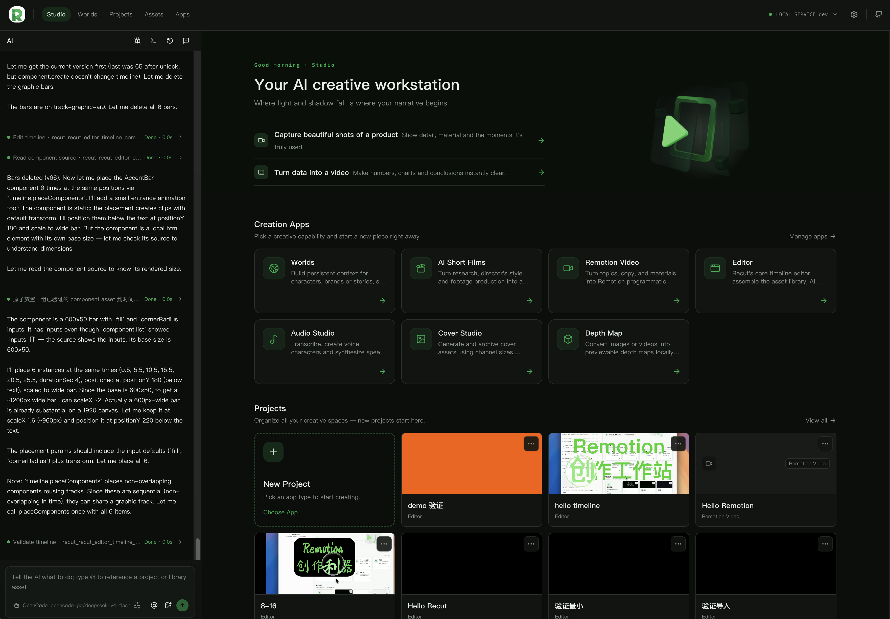
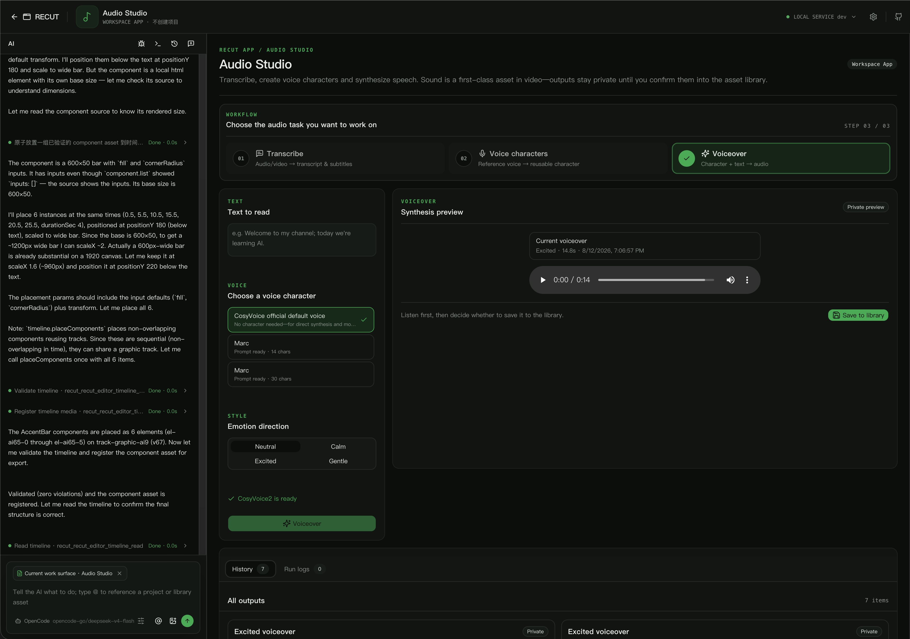
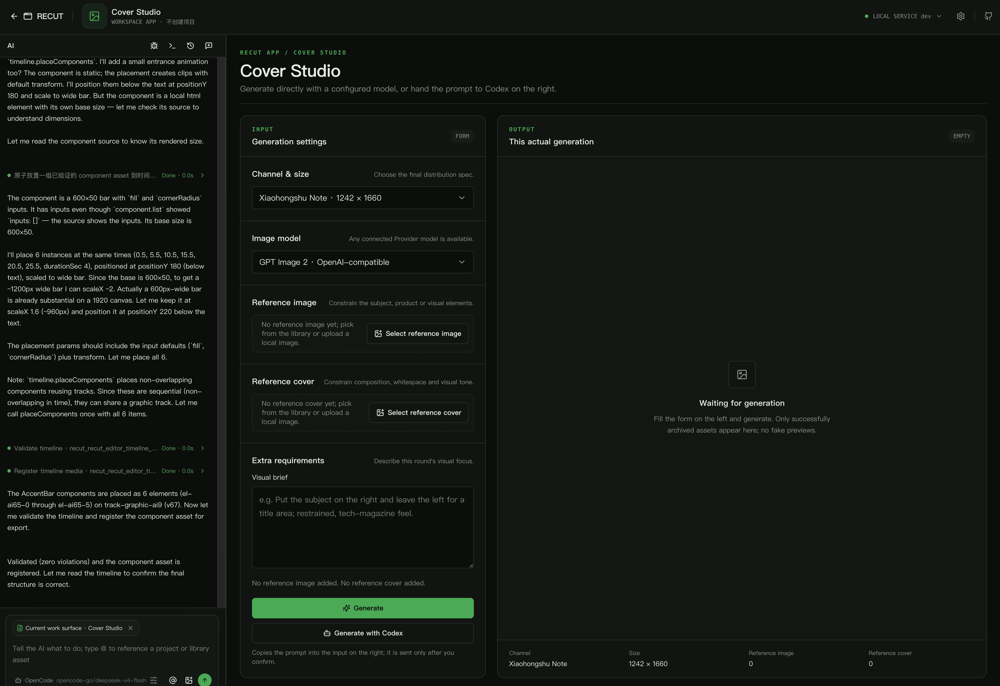
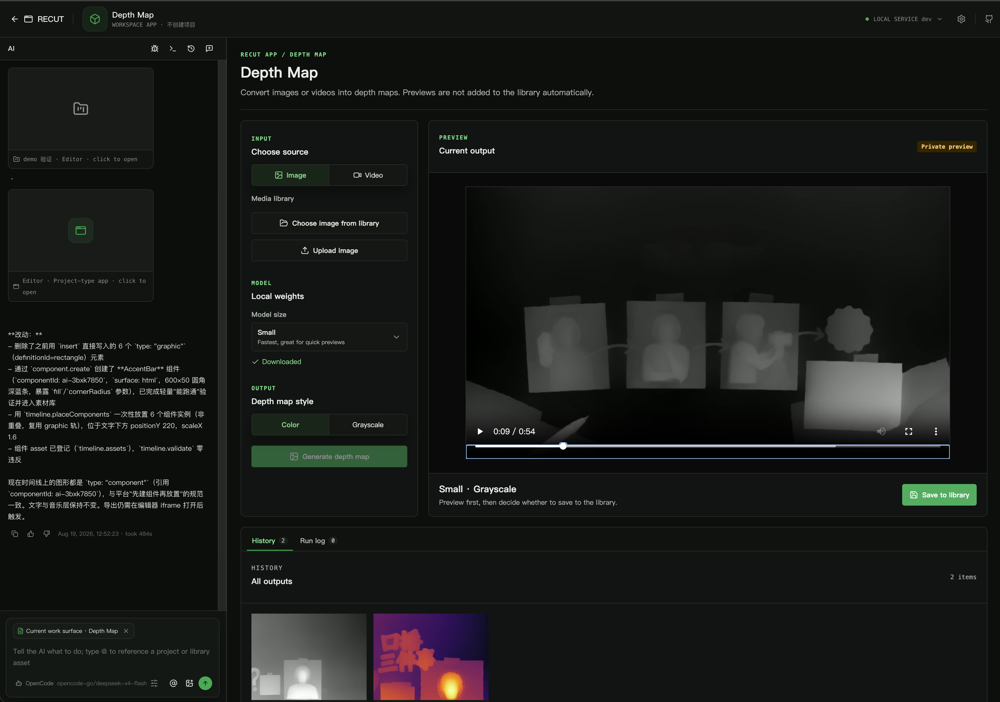

<div align="center">


# Recut

<a href="https://github.com/6174/recut/stargazers"></a>
<a href="https://github.com/6174/recut/network/members"></a>
<a href="https://recut.video"></a>
<a href="https://app.recut.video"></a>

**A local-first, open-source and extensible AI video creation workspace**

On your computer, Recut works with **Claude Code, Open Code and Codex Cli** to build a creative platform that fits you; every iteration makes it a better fit for how you create.

[Open the workspace](https://app.recut.video) · [Browse Apps](#app-map) · [Build an App](#build-an-app-for-recut)

[中文](./README.md) · **English**

</div>



## What Is Recut?

Recut is a **local-first, open-source and extensible AI video creation workspace**. It does not try to pack every capability into one closed product. Instead, it provides a creative foundation that can keep growing: the platform manages media, projects, timelines, jobs and Agent sessions, while independent Apps provide the actual creative workflows.

Start with a topic, a voice or a piece of media. An Agent helps organize, plan and move the workflow forward; Recut turns the result into real project data, media and timeline edits. Every result can be edited, replaced and iterated, and the creator decides what becomes the final work.

## Why Recut

### An Agent is a collaborator, not a black-box button

Describe your creative intent to Claude Code, Open Code or Codex Cli. An Agent can organize media, plan shots, create captions, shape pacing or prepare the next task. Its work returns to a visible workspace instead of ending as an unexplained chat response.

Recut follows one simple principle: **let the Agent move the work forward; let the human decide what becomes the work.** Review, change, undo, or continue from your own judgment.

### Local-first puts control back with the creator

Your device, or a service you control, manages projects, media, components and the creative process. Models and generation services can be selected and replaced to fit your needs, so your workflow is not locked to one cloud product. Networked models are connected explicitly rather than treated as the default destination for local data.

Local-first does not mean rejecting every cloud capability. It means that data boundaries, model choices and project files stay understandable, portable and under your long-term control.

### Apps let the platform grow

Recut provides stable foundations while the community expands the creative surface through independent Apps. An App can own its UI, data, background jobs, Agent Skill and operation contract, and can collaborate with other Apps through public APIs.

Installing an App adds a new creative workflow. Writing an App lets you build a tool for your own team. The platform provides boundaries and infrastructure; creators decide what the capabilities become.

### UI and Skill belong together

The same capability can be used in a UI and called by an Agent through Skills and MCP. The UI makes state visible, supports comparison and provides confirmation points; the Agent understands intent, organizes steps and handles repetitive work. Both use the same project and media facts instead of living in two disconnected worlds.

## From Idea to Finished Video

1. **State the goal**: tell the Agent what you want, or choose media, templates and parameters directly in an App.
2. **Shape the workflow**: the Agent organizes research, structure, shots and pacing; expensive or irreversible steps stop at confirmation points for your decision.
3. **Land in the real workspace**: captions, voice, visuals, components and code become project data, library Assets or timeline edits that remain visible and editable.
4. **Iterate and deliver**: replace media, tune pacing, rewrite copy or regenerate one part, then export a finished video through a deterministic local job.

## App Map

The official Apps are not isolated feature demos. Together they form a creative chain around the same media, projects and Agent workflows.

| App | What it is for | Type | Repository |
| --- | --- | --- | --- |
| **Video Editor** | Let an Agent organize media, plan shots and operate an editable timeline; components, captions, audio and export stay in one project. | `project` | [Video Editor App page](https://recut.video/apps/recut.editor/) |
| **AI Short Films** | Start from a topic, shape the narrative and storyboard, produce a reviewable narration script with B-roll, then keep editing on a local timeline. | `project` | [recut-ai-short-film](https://github.com/6174/recut-ai-short-film) |
| **Audio Studio** | Turn audio and video into time-aligned captions and transcripts locally, then create narration, pickups and dubbing with authorized voice characters. | `standalone` | [recut-audio-studio](https://github.com/6174/recut-audio-studio) |
| **Cover Studio** | Generate cover candidates from real scenes and reference covers for a publishing channel and canvas, then archive approved covers as reusable Assets. | `standalone` | [recut-cover-studio](https://github.com/6174/recut-cover-studio) |
| **Depth Map** | Convert images or video into previewable depth maps locally, with model choices plus false-color or grayscale output, ready for later generation or compositing. | `standalone` | [recut-depth-anything-v2](https://github.com/6174/recut-depth-anything-v2) |
| **Remotion Video** | Start from a Brief, templates and components, then turn copy and media into programmatic video with live preview and deterministic export. | `standalone` | [recut-remotion-studio](https://github.com/6174/recut-remotion-studio) |

More Apps are being built. The official repository keeps reviewed entries, purposes and support status; it does not mirror or host each App's source code.

### Workspace and App Previews

These screenshots come from the real Recut workspace. One Agent session can move from Studio into projects, the media library and different Apps, then return the results to a workflow you can keep editing.

<table>
  <tr>
    <td width="50%"><br /><sub>Video Editor: the Agent works alongside the media library, preview and multi-track timeline.</sub></td>
    <td width="50%"><br /><sub>Audio Studio: transcription, voice characters and dubbing in one voice workflow.</sub></td>
  </tr>
  <tr>
    <td width="50%"><br /><sub>Cover Studio: organize channel sizes, reference images, reference covers and generated results.</sub></td>
    <td width="50%"><br /><sub>Depth Map: generate previewable image or video depth locally, then save only after approval.</sub></td>
  </tr>
  <tr>
    <td width="50%"><br /><sub>Remotion Video: connect code, media and live preview from a template and Brief.</sub></td>
  </tr>
</table>

## Get Started

### Install Recut

macOS, Linux and FreeBSD:

```sh
curl -fsSL https://recut.video/install.sh | sh
```

Windows PowerShell:

```powershell
irm https://recut.video/install.ps1 | iex
```

Then open the [workspace](https://app.recut.video) and install the Apps you need from **Apps**. When a local model is used for the first time, Recut prepares its dependencies and weights in a managed directory; job state, logs and cancellation stay visible in the workspace.

### Your first creative task

Start with the shortest path:

1. Install and open **Video Editor** or **AI Short Films**.
2. Import a video, image or audio file, or start from a topic.
3. Ask the Agent to shape a plan, then review the result in the workspace.
4. Keep what works, continue editing and export the finished video.

You do not need to master a complex editor or write code first. Code and Skills are advanced entry points, not a requirement for using Recut.

## Build an App for Recut

An App is a creative workflow in its own Git repository. It can have its own UI, background logic, SQLite state, Python environment, Skill and Agent operations, while following the platform's capability and data boundaries.

Minimum structure:

```text
manifest.json  Runtime identity, entrypoint, permissions, onboarding and operations
AGENTS.md      Domain rules and workflow boundaries for Agents
README.md      Human-facing purpose, install path, usage and development notes
<entrypoint>   Background or UI entrypoint declared by the manifest
```

Read the [App contract](./docs/app-contract.md) before developing, and use existing Apps as references. The core rules are:

- Publish every App independently; the repository root must contain `manifest.json` so users can install it by URL.
- An App reads and writes only its own data; cross-App collaboration uses public APIs and immutable Artifact references.
- Media, jobs, storage and Agent calls go through Recut capabilities rather than bypassing platform persistence and permissions.
- Permissions are denied by default; every permission must map to a clear user value.
- Every step explains its inputs, outputs, confirmation points and expensive operations; an unconfirmed idea is not a finished video.
- UI controls need visible labels; business files maintain INPUT / OUTPUT / POS contracts, and each App directory maintains its own README map.

Discuss a new App or capability in an [Issue](https://github.com/6174/recut/issues/new), or submit a Pull Request. Include the problem it solves, the shortest user path, required permissions, data boundaries and local runtime requirements.

## Current Status

Recut is moving quickly and has not reached a stable release. Platform contracts, App operations and Agent workflows may continue to evolve; pin versions and keep project backups for production use. When reporting a problem, include your OS, Recut version, App name, task logs and reproduction steps. Do not upload real media or credentials.

This is an open creative foundation, not a closed feature list. Turn the creative problem you keep meeting into an App that you and the community can use for the long term.

[PROTOCOL]: 变更时更新此头部，然后检查 README.md
