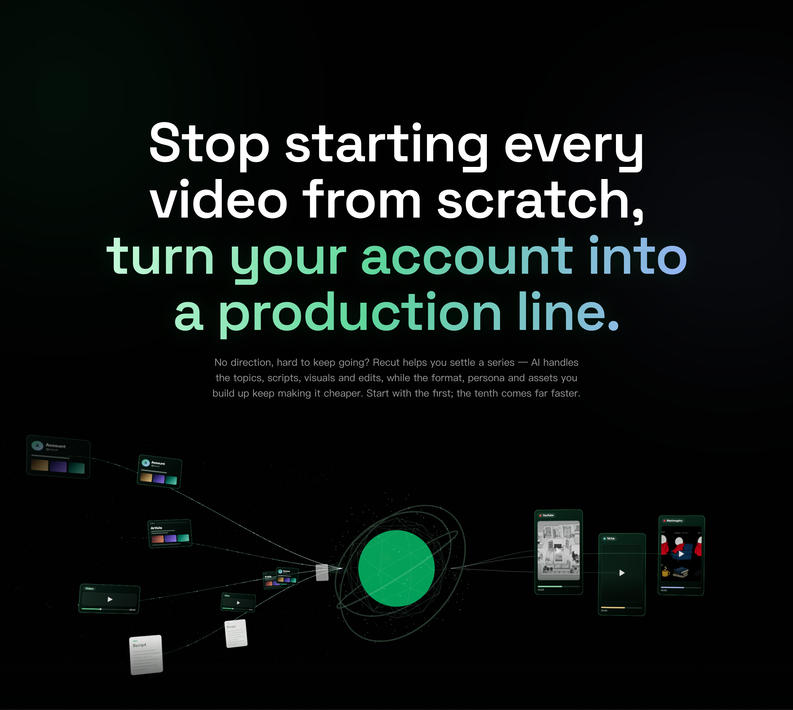

<div align="center">


# Recut

<a href="https://github.com/6174/recut/stargazers"></a>
<a href="https://github.com/6174/recut/network/members"></a>
<a href="https://recut.video"></a>
<a href="https://app.recut.video"></a>

**One series, endless episodes — turn your account into a reusable production line.**

A free, open-source, local-first AI video creation workspace. Settle your account's topics, format, persona and assets into a series, and AI keeps shipping on-brand videos — the first one starts you off, the tenth comes far faster. On your computer, Recut works with **Claude Code, Open Code and Codex Cli**; each pass makes your series assets more complete and the next video easier.

[中文](./README.md) · **English**

</div>




## What Is Recut?

Recut is a **local-first, open-source and extensible AI video creation workspace**. Settle your account's topics, format, persona and assets into a series, and AI keeps shipping on-brand videos; or drop in a reference video, an idea or a story, and AI handles the research, planning, generation, editing and delivery.

It does not try to pack every capability into one closed product. Instead, it provides a creative foundation that can keep growing: the platform manages media, projects, timelines, jobs and Agent sessions, while independent Apps provide the actual creative workflows. Every step lands in real projects, media and timeline edits, so results can be edited, replaced and iterated, and the creator decides what becomes the final work.

## One Series, Endless Episodes

Settle your account's topics, format, persona and assets into a series, and AI keeps shipping on-brand videos — easier with every pass. A reference video or an idea can be the seed of a new series, too.

### A series: settle once, keep shipping

Turn your topics, format, visual templates, persona and assets into a reusable production spec, not a fresh start every time. From one series, keep iterating and ship new videos across platforms and languages.

### A reference video: clone a proven hit

Drop in a video you love. AI reads its hook, story, shots, pacing, caption style, voice and visual language, then rebuilds it as your own version: same idea, different story, your brand, your characters, your voice.

### An idea: start from a topic

Write down the topic you want to cover. Research, writing, directing and editing are split across agents, and every step lands on a real timeline you can trim, reorder, recaption and re-render — no black box. You decide what to make; AI does the making.

## Why Recut

### An Agent is a collaborator, not a black-box button

Describe your creative intent to Claude Code, Open Code or Codex Cli. An Agent can organize media, plan shots, create captions, shape pacing or prepare the next task. Its work returns to a visible workspace instead of ending as an unexplained chat response.

Recut follows one simple principle: **let the Agent move the work forward; let the human decide what becomes the work.** Review, change, undo, or continue from your own judgment.

### Local-first puts control back with the creator

Your device, or a service you control, manages projects, media, components and the creative process. Models and generation services can be selected and replaced to fit your needs, so your workflow is not locked to one cloud product. Networked models are connected explicitly rather than treated as the default destination for local data.

Local-first does not mean rejecting every cloud capability. It means that data boundaries, model choices and project files stay understandable, portable and under your long-term control. Recut is free and open source with no per-video billing; compared with cloud tools that require uploads and charge by credits or membership, it is a third option you can self-host long-term and extend with code.

### Apps let the platform grow

Recut provides stable foundations while the community expands the creative surface through independent Apps. An App can own its UI, data, background jobs, Agent Skill and operation contract, and can collaborate with other Apps through public APIs.

Installing an App adds a new creative workflow. Writing an App lets you build a tool for your own team. The platform provides boundaries and infrastructure; creators decide what the capabilities become.

### UI and Skill belong together

The same capability can be used in a UI and called by an Agent through Skills and MCP. The UI makes state visible, supports comparison and provides confirmation points; the Agent understands intent, organizes steps and handles repetitive work. Both use the same project and media facts instead of living in two disconnected worlds.

## From Topic to Finished Video

1. **Give it a starting point**: pick a series, drop in a reference video, or write an idea; or choose media, templates and parameters directly in an App.
2. **Let AI shape the plan**: the Agent breaks down the reference, researches the topic, writes the script and plans shots and pacing; expensive or irreversible steps stop at confirmation points for your decision.
3. **Land in the real workspace**: captions, voice, visuals, components and code become project data, library Assets or timeline edits that remain visible and editable.
4. **Iterate and deliver**: replace media, tune pacing, rewrite copy or regenerate one part, then export a finished video through a deterministic local job.

## Get Started

### Install Recut

macOS, Linux and FreeBSD:

```sh
curl -fsSL https://recut.video/install.sh | sh
```

Windows PowerShell:

```powershell
irm https://recut.video/install.ps1 | iex
```

Then open the [workspace](https://app.recut.video) and install the Apps you need from **Apps**. When a local model is used for the first time, Recut prepares its dependencies and weights in a managed directory; job state, logs and cancellation stay visible in the workspace.

### Your first creative task

Start with the shortest path:

1. Install and open the **Video Editor**.
2. Give it a starting point: pick a series, import a reference video, or write an idea.
3. Ask the Agent to move the plan forward, then review the result in the workspace.
4. Keep what works, continue editing and export the finished video.

You do not need to master a complex editor or write code first. Code and Skills are advanced entry points, not a requirement for using Recut.
