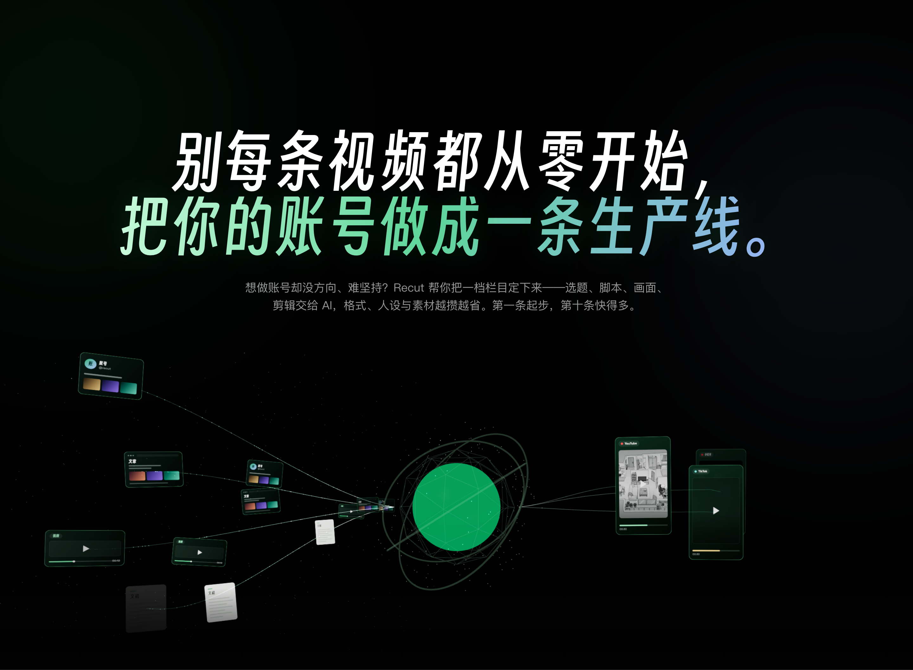

<div align="center">


# Recut

<a href="https://github.com/6174/recut/stargazers"></a>
<a href="https://github.com/6174/recut/network/members"></a>
<a href="https://recut.video"></a>
<a href="https://app.recut.video"></a>

**别再靠抽卡做视频，开始经营一个世界。**

免费、开源、本地优先的 AI 视频创作工作台。在无限画布上沉淀角色、风格、场景与规则，AI 就能自动生成并剪出视频——同一个世界观，无限条视频。在你的电脑上，Recut 与 **Claude Code、Open Code、Codex Cli** 协作；每一次迭代，世界更完整，产出更省力。

**中文** · [English](./README.en.md)

</div>




## Recut 是什么

Recut 是一个**本地优先、开源、可扩展的 AI 视频创作工作台**。把角色、风格、场景与规则沉淀成一个 World，AI 就能持续生成并剪出风格一致的视频；也可以丢进一条参考视频、一个想法或一个故事，由 AI 自动完成调研、策划、生成、剪辑与成片。

它不是把所有能力塞进一个封闭软件，而是提供一条可以持续生长的创作底座：素材库、项目、时间线、媒体任务和 Agent 会话由平台管理，具体的创作能力由独立 App 组成。每一步都落在真实的项目、素材和时间线上，结果可以继续编辑、替换和迭代，创作者始终决定什么进入最终作品。

## 一个世界观，无限条视频

在无限画布上沉淀角色、风格、场景与规则，AI 就能自动生成并剪出视频——越做越省力。一条参考视频或一个想法，也可以成为一个新世界的起点。

### 一个世界观：创作一次，持续产出

把角色、故事与风格做成一个 World，固化成一个可长期复用的永久资产，而不是每次从零生成。同一个世界观，可以不断迭代，持续产出各平台、各语言的新视频。

### 一条参考视频：复刻已经验证的爆款

丢进一条你喜欢的视频。AI 读懂它的钩子、故事、分镜、节奏、字幕风格、声音与视觉语言，再重建成你自己的版本：同样的思路，不同的故事，你的品牌、你的角色、你的声音。

### 一个想法：AI 全自动完成

写下你想表达的内容。调研、编剧、导演、剪辑由 Agent 分工推进，每一步都落在真实时间线上，可以裁剪、排序、改字幕、重新导出，没有黑盒。你决定做什么，AI 负责做出来。

## 为什么是 Recut

### Agent 是协作者，不是黑盒按钮

向 Claude Code、Open Code 或 Codex Cli 描述创作意图，Agent 可以帮你整理素材、规划镜头、生成字幕、搭建节奏或准备下一步任务。它的结果会回到可见的工作区，而不是停留在一段不可解释的聊天回复里。

Recut 的原则很简单：**让 Agent 推进工作，让人决定作品。** 你可以审阅、修改、撤销，或者沿着自己的判断继续迭代。

### 本地优先，控制权留在创作者一侧

项目、素材、组件和创作过程由你的设备或你控制的 service 管理。模型和生成服务可以按你的需要选择与替换，工作流不被某一家云端产品锁死；需要联网的模型由你明确接入，不把本地数据默认交给平台。

本地优先不是拒绝所有云端能力，而是让数据边界、模型选择和作品文件都回到你能理解、迁移和长期掌控的位置。Recut 免费开源、不按条计费；与需要上传素材、按积分或会员计费的云端工具相比，它是可以长期自部署、用代码扩展的第三种选择。

### App 让平台持续生长

Recut 只提供稳定的基础能力，社区通过独立 App 扩展创作场景。一个 App 可以拥有自己的 UI、数据、后台任务、Agent Skill 和操作契约，也可以通过公开 API 与其他 App 协作。

安装一个 App 就像增加一条新的创作工作流；写一个 App，就像为自己的团队造一台专属工具。平台负责边界与基础设施，创作者决定能力长成什么样。

### UI 与 Skill 同时存在

同一个能力既可以在界面里操作，也可以被 Agent 通过 Skill 和 MCP 调用。界面负责看见状态、比较结果和做确认；Agent 负责理解意图、组织步骤和执行重复工作。两者共享同一份项目与素材事实，不再是两个互相割裂的世界。

## 从想法到成片

1. **给出一个起点**：选一个世界观、丢进一条参考视频，或写下想法；也可以直接在 App 中选择素材、模板与参数。
2. **AI 推进方案**：Agent 拆解参考、调研选题、编写脚本、规划分镜与节奏；昂贵或不可逆的步骤会停在确认点等待你的选择。
3. **落到真实工作区**：字幕、声音、画面、组件和代码进入项目、素材库或时间线，结果可见、可编辑、可继续制作。
4. **持续迭代并交付**：替换素材、调整节奏、修改文案、重新生成局部结果，最后由本机任务确定性导出成片。

## 开始使用

### 安装 Recut

macOS、Linux、FreeBSD：

```sh
curl -fsSL https://recut.video/install.sh | sh
```

Windows PowerShell：

```powershell
irm https://recut.video/install.ps1 | iex
```

安装完成后打开 [工作台](https://app.recut.video)，在 **Apps** 中安装需要的应用。首次使用某些本地模型时，Recut 会在受管目录准备依赖和模型；任务状态、日志与取消入口都会保留在工作区内。

### 第一个创作任务

可以从最短路径开始：

1. 安装并打开 **视频剪辑**。
2. 给出一个起点：选一个世界观、导入一条参考视频，或写下想法。
3. 让 Agent 先推进方案，再在工作区中审阅结果。
4. 保留需要的部分，继续修改，最后导出成片。

不需要先学会复杂的剪辑软件，也不需要先写代码；代码和 Skill 是进阶入口，不是使用门槛。