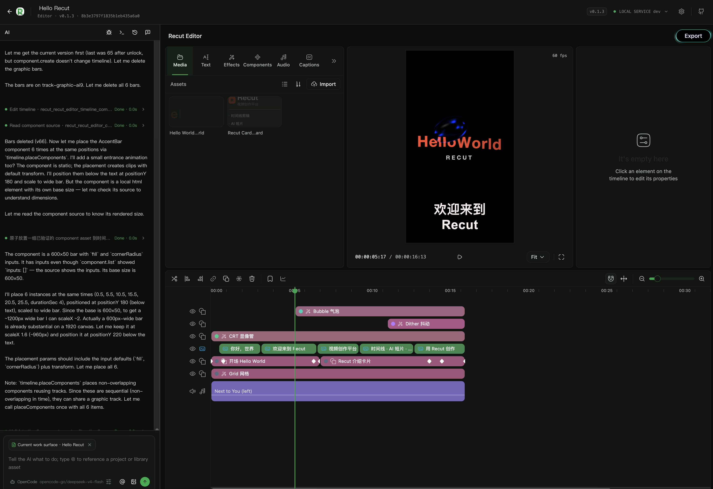

<div align="center">


# Editor

**A CapCut-style timeline to assemble media, text, effects and sound into a finished cut**

The core editing workspace for Recut — where media library, AI short films and programmatic video come together

[中文](./README.md) · **English**

</div>



## What it is

Editor is Recut's **timeline editing App** (`project` type). It does not do closed one-click generation. Instead it gives you an editable, undoable and iteratively refinable timeline: media, text, components, captions, audio and export all live in the same project.

- **Start from media or from an idea**: drag existing video / image / audio onto the timeline, or let an Agent turn a topic into a storyboard and draft first, then keep refining on the timeline.
- **Human and Agent share the same facts**: the UI makes state visible and asks for confirmation; the Agent organizes, plans and executes repetitive work on the same timeline through Skills.
- **Every result stays editable**: every clip, track and param can be changed again. Export is just a deterministic snapshot of the current version.

> Ships built-in with Recut — no extra download. Also the default bundled App for `make dev` / `make service-build`.

## Why Editor

### The timeline is the single source of truth

Tracks, clips, keyframes, transitions and mix are all visible on the timeline. Agent edits land through the same `timeline.command` unified op log with undo/redo — no black-box "chat and it's gone".

### Components live alongside real media

Text, graphic components (verified component Assets) and real media are first-class citizens. Components are reusable, parameterized and animatable; media comes from the global library. Both composite through the same render pipeline for preview and export.

### Captions are a workflow, not a sticker

Transcription → caption track → editable transcript share one source: local ASR → caption track (shared `captionStyle`) → transcript bound to speech elements. Editing a caption edits the timeline; editing the transcript edits the audio structure.

### What you preview is what you export

Preview canvas and export share the same rendering and mixing logic (including auto-duck). What you see is what gets delivered.

## From idea to finished video

1. **Drop media in**: drag video / image / audio from the library, or import an AI short-film handoff via `film.package.import`.
2. **Shape the structure**: organize visuals and sound with tracks; let the Agent batch-place clips from a transcript or storyboard when needed.
3. **Refine the look**: tune params, add keyframes, apply effects/transitions. Browse built-ins first via `library.browse` for effects and music.
4. **Handle sound & captions**: generate captions with local transcription, bind the transcript for filler-word and gap cleanup, set anchor/follower roles for auto-duck.
5. **Preview and deliver**: frame-accurate preview on canvas (`preview.frame` / `preview.contact-sheet`), validate, then `export.start` for a deterministic MP4.

## Capabilities

| Capability | What you can do | Key operations |
| --- | --- | --- |
| **Multi-track timeline** | Insert / delete / trim / split / retime / param / keyframes; scenes & bookmarks | `timeline.command` · `timeline.read` · `timeline.validate` |
| **Component Assets** | Create reusable components from a natural-language brief, verify, publish to the library, then place on demand | `component.create` → `timeline.placeComponents` · `component.revise` |
| **Captions & transcript** | Local transcription, SRT/ASS import, shared caption style, transcript-driven editing | `subtitle.generate` / `subtitle.import` · `script.read` / `script.apply` / `script.clean` |
| **Audio mix** | Anchor/follower auto-duck, boundary smoothing | `track.role` · `audio.smooth` |
| **Preview & export** | True rendered frame preview, batch & contact-sheet preview, deterministic MP4 + cover | `preview.frame` · `export.start` · `cover.set-frame` / `cover.set-asset` |
| **Project collaboration** | Exclusive lock, delta sync, op log with undo, Asset registration | `project.lock` · `timeline.delta` · `history.undo/redo` |

> Full operation contract: `manifest.json` → `operations`. Agent constraints: `skills/recut-editor/SKILL.md`.

## Quick start

### Open in Recut

1. Install and launch Recut (see root [README](../../README.en.md#install-recut)).
2. Open a project in the workspace and enter **Editor**.
3. Drag Assets from the right-side library onto the timeline, or ask the Agent: `read workflow.context and timeline.read first, then lay out the timeline as requested`.

### Let the Agent cut for you

In Claude Code / OpenCode / Codex Cli, tell the project:

> "Use Editor for this request [remove fillers and long gaps from this talking-head, keep key points, add bilingual captions, export 1080p]. Read workflow.context and timeline.read first, decide whether this is a new video or an edit on the existing timeline, change only what's necessary, preview affected settled frames, validate, then export."

The Agent picks the transcript-cleanup, caption-generation or timeline-edit route automatically and lands the result back on your timeline.

## Tour

- **Preview canvas**: WYSIWYG, frame-accurate seek and cover picking.
- **Timeline**: CapCut-style multi-track with scene folding, track roles and keyframe editing.
- **Library panel**: Global media and component library with search and one-click placement.
- **Inspector**: Tune params, keyframes, effects and masks for the selected clip.
- **Export panel**: Choose resolution & fps, export in one click; pick a frame or a library Asset as cover.


<sub>Agent, media library, preview and multi-track timeline in one workspace.</sub>

## FAQ

**Black preview / export?** Editor relies on Chromium's `CanvasDrawElement` (Chrome 149+). Enable `chrome://flags/#canvas-draw-element` or launch with `--enable-features=CanvasDrawElement`. For Playwright, reuse `ui/tests/e2e/helpers.ts:launchEditorBrowser()`.

**Caption generation disabled?** Install Audio Studio and prepare an ASR model first. Editor checks via `subtitle.capabilities` and guides installation.

**Replace media but keep timing?** Swap the `assetId` in the Inspector, or ask the Agent to do a media-replacement pass. Timeline structure and keyframes stay intact.

## For developers

Editor is also an extensible Recut App. UI lives in `ui/` (React + TypeScript + Vite); background loads `manifest.json:backgroundModules` in order into one Goja sandbox.

```sh
# Build editor UI only (required before bundling)
make editor-ui-build

# Local dev (also builds built-in App archives)
make dev

# Model & render checks
make editor-model-test
make editor-frame-render-test
make editor-authoring-quality-test
```

- Runtime consumes `ui/dist/index.html`; `ui/dist/` and `node_modules/` are gitignored.
- Architecture & contracts: `manifest.json` · `background/` · `skills/recut-editor/SKILL.md` · `skills/recut-editor/references/`.
- Platform comms and operation boundaries: root `docs/app-contract.md`.

[Back to root README](../../README.en.md) · [App map](../../README.en.md#app-map)
