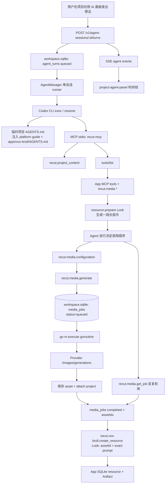
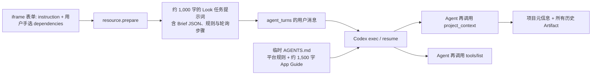
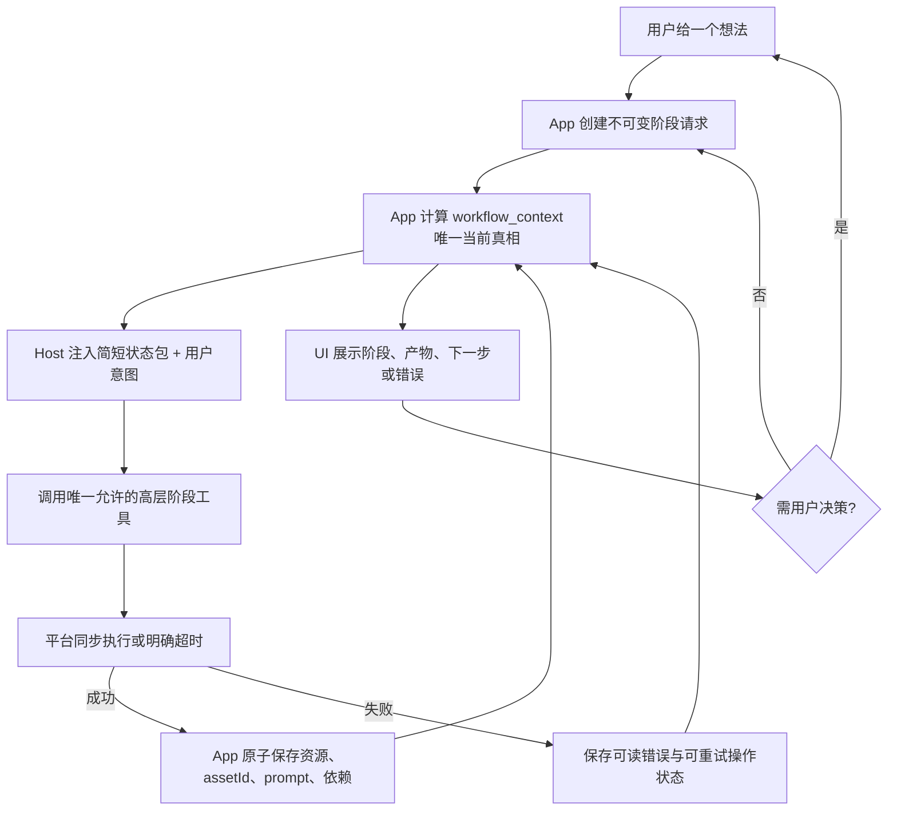

# Vox B-roll Agent 现阶段执行流程审计（2026-07-27）

> 范围：只读梳理。依据真实项目 `788394aa2db26fc67fd1e1b7`（Hello）、浏览器页面、Daemon HTTP 数据与本地 SQLite；没有提交、重试或删除任何媒体任务。

## 结论先行

当前 B-roll 的 Look 阶段不是一个能可靠完成的单一流程。它把一个必须等待图片结果的创作步骤拆成了「Agent 回合」与「进程内异步 Job」两个没有共同生命周期的流程：Agent 需要自行记住并轮询 `jobId`，而 Job 的 worker 不能跨服务重启。于是 Agent 回合结束、工具连接短暂失效、或服务重启任一发生，都可能使 Look 永远没有 `assetId`。

真实项目还存在一个独立的前端契约破损：对话详情中所有 Turn 的 `attachments` 字段缺失，`project-agent-panel.tsx` 未做空数组兜底就调用 `.map()`，项目页面已被运行时错误覆盖。因此用户无法在 UI 中连续、可信地观察这个工作流。

## 真实项目观察

| 事实 | 证据 |
| --- | --- |
| 图片用途路由已启用 | `image.generate.default` → `openai-compatible/image` → `gpt-image-2`；输入模式为 text。|
| 首次 Look A 任务 | `49d462c94772dcc1daadb71a`，2026-07-26 曾停在 `running`；服务重启后被标记 `failed`。|
| 重试 Look A 任务 | `99e7b57fe456f34b8ec734f9`，2026-07-27 00:01 创建、00:01:52 仍为 `running`；00:05:06 服务启动恢复逻辑将它标记为 `failed`。|
| 失败原因不是模型显式返回 | 两条失败信息均为「本地服务重启前任务未完成，请重新生成。」；不是 Provider 错误，也没有结果资产。|
| B-roll App 当前存储 | `resources` 只剩 Brief 与两份 Beats；旧格式 Look 因缺少 `assetId` / `prompt` 被首次读取时清理。历史 Artifact 与聊天文字曾把无图 Look 描述为已完成，二者已脱节。|
| 浏览器 E2E 状态 | `http://localhost:3000/projects/788394aa2db26fc67fd1e1b7` 当前显示 `Runtime TypeError: Cannot read properties of undefined (reading 'map')`，位置为 `web/components/project-agent-panel.tsx:47`。|

## 实际调用图



## 阶段逐项展开

### 1. UI 与 Agent 回合

1. 项目页加载 `ProjectAgentPanel`，读取 `/v1/agent-sessions?projectId=…`；若无会话则创建 Codex 或 Claude 会话。
2. 用户发消息时，前端把文本与已上传图片的 `assetIds` 提交给 `POST /v1/agent-sessions/:id/turns`。
3. `AgentManager.StartTurn` 验证附件确属当前项目，写入 `agent_turns` / `agent_turn_attachments`，把会话置为 `running`，然后启动一个内存 runner。
4. runner 串行读取 queued 用户消息。每条消息启动一次 `codex exec`；续聊时使用该会话保存的 native thread id。

**当前 UI 断点**：服务端 `ChatTurn` 契约声明 `attachments` 必然存在，但真实 `/v1/agent-sessions/:id` 响应中它缺失。页面在 `group.user.attachments.map(...)` 处崩溃。即使媒体流程正确，用户也无法以 E2E 方式连续验证工具状态、错误与产物。

### 2. 工具与上下文注入

每次 Codex 回合会在项目临时目录写入：

- 平台规则：先 `recut.project_context`，再 `tools/list`；生成前读取 `recut.media.configuration`；禁止直接读写项目文件。
- `apps/vox-broll/AGENTS.md`：规定 `Brief → Beats → Look → Keyframes → Motion → Audio → Delivery`，Look 必须有图片 `assetId` 与原始 `prompt`。
- Recut MCP 配置：短生命周期 session token 通过子进程环境传入，MCP Host 按当前项目的 manifest 暴露工具。

MCP `tools/list` 实际暴露两类能力：平台 `recut.media.*`（configuration / generate / get_job / list_assets / attach）和 App `recut.vox-broll.*`（generate_brief / create_resource / retire_resource / delete_resource）。

这里的关键事实是：**注入的是行为说明，不是编排器**。`resource.prepare(kind=Look)` 只返回一段提示词，要求模型「依次生成 3 张图、轮询、保存资源、停下」。没有服务端状态机、没有循环预算、没有超时完成语义，也没有“一个 Look 计划”的父记录。

### 3. Look 的当前实际步骤

`resource.prepare` 把 Look 请求转为以下由 Agent 自行执行的序列：

1. 为候选 A/B/C 起草提示词。
2. 调用 `recut.media.configuration`。
3. 每个候选调用 `recut.media.generate(image.generate, prompt, output)`；返回的是 `{ jobId, status: "queued" }`，不是图片。
4. Agent 在同一或后续回合内反复调用 `recut.media.get_job(jobId)`，直到 `completed`。
5. 仅当结果带有 `assetIds` 时，调用 `recut.vox-broll.create_resource` 保存 `{ assetId, prompt, ... }`。
6. 停下来等用户选择，才允许进入 Keyframes。

这条规定避免了“无图 Look”进入后续阶段，但只把完整性责任推给了 LLM。真实聊天记录已经出现两种偏差：旧版提示词先创建文字 Look 再让用户选 A；新版才要求先生成图片。清理旧 Look 后，历史回答/Artifact 仍说 Look 已完成，而 App 当前资源表并不承认它。

### 4. 媒体任务的现状

`MediaService.Generate`：

1. 校验 capability、prompt、route、凭据和引用素材；写一条 `media_jobs(status=queued)`。
2. `go m.execute(job, credential)` 启动进程内 goroutine 后立即返回。
3. worker 先写 `running`，使用 2 分钟 HTTP timeout 请求 OpenAI 兼容 `/images/generations`（有参考图时改为 `/images/edits`）。
4. 成功时保存图片资产并把 Job 改为 `completed + assetIds`；Provider 错误、超时或保存错误时改为 `failed + error`。

worker 不是持久化队列：Daemon 重启时 `RecoverInterruptedJobs` 会把所有 `queued` 与 `running` Job 改为 `failed`，明确不自动重试。因此截图中“长期 running 且更新时间不动”的真实含义并非 Agent 还能等到结果，而是 worker 所在进程已不再保证存在；直到下次服务启动才被终结为失败。

## 为什么当前设计对 AI 不友好

| 层 | 现状 | 造成的歧义 |
| --- | --- | --- |
| Agent turn | `codex exec` 是有结尾的请求/响应回合 | Job 可以在回合结束后继续，模型必须记住要回来轮询。|
| Job | 纯异步，Job ID 是唯一续接线索 | 没有把 Job 的结束事件反推到 Agent/Look 阶段。|
| 服务生命周期 | goroutine 只活在当前 Daemon 进程 | 重启将有效任务变为“需要手工重试”的失败。|
| Look 业务状态 | 只有最终 `create_resource` 才落库 | 生成中、超时、候选 A/B/C 的进度没有可查询的业务真相。|
| UI | 仅显示 Agent event 的工具点和回合状态 | 既不拥有 Job 轮询，也不能在页面崩溃时解释任务事实。|
| 历史兼容 | 旧文字 Look 被延迟清理 | Artifact/聊天叙述与资源表发生双真相。|

根因不是单一 Agent 工具缺失。系统把“等待外部媒体结果”当成 LLM 提示词里的临时动作，而它其实是平台应拥有的、可超时的同步业务操作。可变且无主的中间状态正是复杂度来源。

## 同步模式应承担的边界（设计结论，尚未实施）

用户期望的「给 AI 一个想法，自动完成各阶段」需要把 Look 的一张参考图视为一个原子操作：调用开始后，平台在限定时间内等待最终 `assetId` 或明确错误，Agent 只收到两种结果之一。

建议的最小语义：

```text
recut.media.generate(prompt, output)
  -> { assetId, prompt, ... }       // 成功
  -> error { code, message, jobId } // Provider 失败、超时、服务中断
```

这不是要求所有媒体能力永远同步；它是给 Agent 工作流一条适合“必须立即消费结果”的路径。视频等天然长任务仍可保留异步 Job，但它们必须有持久化状态机和由平台驱动的回调/恢复，不能要求模型记忆轮询。

对于 Look，最干净的业务边界是：平台/App 提供一个「生成并保存 Look 候选」命令，内部完成配置检查、一次同步图片生成、`assetId + exact prompt` 持久化；如果任一步超时，**不创建 Look**，并返回可显示的错误。这样 Agent 不再承担 Job ID 管理、轮询节奏与部分成功清理。

## 提示词与上下文注入复核

### 现有注入链不是一个“项目状态包”

一次从 B-roll iframe 发起的创建，实际经历三层文本拼接：



它并没有在运行前提供一个结构化的“当前工作流状态”。模型必须先从文字、全部 Artifact 和会话记忆推断现在的阶段，再从长提示词里反推任务。这就是本质上的多真相源。

### 真实状态为什么没有送到模型手里

| 数据 | 实际位置 | 当前是否直接可读 | 后果 |
| --- | --- | --- | --- |
| 项目 ID、App ID、版本 | `project.sqlite` | `recut.project_context` | 可见，但只是身份。|
| Artifact 历史 | `project.sqlite` | `recut.project_context` 返回全部 | 包含已淘汰 Look，不能作为当前状态。|
| Brief / Beats / Look 的当前有效资源 | `apps/recut.vox-broll/storage.sqlite` | **MCP 不可读** | 这是业务真相，但 Agent 无法用工具读取。|
| UI 中勾选的依赖 | iframe 内存 → `resource.prepare` | 被序列化为字符串 | 没有由平台验证它们是否是阶段所需的、仍有效的前置资源。|
| 媒体 Job 状态 | `workspace.sqlite` | `recut.media.get_job` | 仅在 Agent 记得 `jobId` 时可读。|
| 前次聊天 | native Codex thread | 隐式续聊 | 可能携带过期断言，不是状态真相。|

`Bridge.Context()` 目前的 `appState` 实际只有 `{ appId }`。而 App Guide 中提到的 `brief.latest`、`resource.prepare`、`resource.list` 是 **UI API**，不是当前 manifest 暴露给 Agent 的 MCP 工具；manifest 的 MCP 仅有 `generate_brief`、`create_resource`、`retire_resource`、`delete_resource`。因此“先读项目状态”的平台规则在 B-roll 上无法实现为对 App 私有业务状态的读取。

真实项目恰好证明了后果：project context 仍返回两个旧 Look Artifact，但 App 的 `resources` 表已经因缺少 `assetId` / `prompt` 清理了它们。模型看到历史 Artifact 会相信 Look 曾完成；UI 当前资源表却正确地认为 Look 不存在。

### 当前提示词的具体问题

1. **同一事实重复且互相竞争。** 平台 Guide、App Guide、`resource.prepare`、历史对话和 Artifact 都讲“下一步是什么”；没有优先级化的单一当前状态。
2. **提示词在教模型编排基础设施。** Look 的 4 步要求模型管理 Job ID、轮询、失败处理和持久化。这是服务端控制流，不是创作推理。
3. **`resource.prepare` 是 UI 动作的文本化代理。** 它把 `Brief` JSON、依赖字符串和长 prose 拼成用户消息，而不是创建一个可追踪的阶段请求。这个 1,000 余字符的消息随后还留在 native 会话中，继续污染后续 turn。
4. **未定义阶段准入。** 用户可从任意 Stage 卡片打开表单，也可任意勾选资源。业务层没有用当前资源图拒绝“没有已选 Beats 就生成 Look”或“Look 未批准就生成 Keyframes”。
5. **“生成 3 个候选”是一个多动作事务，却只给一个自由文本命令。** 一个候选成功、一个超时、Agent 回合结束时，没有可恢复、可展示、可重入的计划记录。
6. **每回合都要求 `project_context` + `tools/list`，却不把结果压缩为可行动结论。** 工具列表是稳定元数据，不需要模型在每一次创作回合重新消化；状态则应被精确、按需地提供。

长 Guide 不是唯一问题，甚至不是主因。稳定的领域规则可以保留在 Guide；真正拖垮完成率的是运行时把“当前事实”和“下一步动作”藏在工具调用、历史文本和模型记忆里。

## 面向最佳 B-roll 体验的正确上下文模型（设计结论，尚未实施）

目标不是把所有项目数据库原样塞进 prompt，而是让 App 产生一份**唯一、紧凑、版本化、可验证的创作状态包**。它必须是 App capability 的返回值，不能让平台或 Agent 直接读取 App SQLite。

建议新增只读 MCP 工具，例如 `recut.vox-broll.workflow_context`，返回固定结构：

```json
{
  "project": { "id": "…", "title": "…" },
  "revision": "…",
  "stage": "look",
  "nextAction": "generate_look_candidates",
  "gates": { "beatsApproved": true, "lookApproved": false },
  "inputs": {
    "brief": { "id": "brief:…", "summary": "…" },
    "beats": { "id": "beats:…", "summary": "6 beats / 54 sec", "items": [] }
  },
  "selected": { "look": null },
  "inFlight": null,
  "allowedActions": ["generate_look_candidates"],
  "validation": []
}
```

这个状态包解决三个问题：

- **直接上下文**：每个 turn 在启动前由 Host 注入该包，模型无需先猜测项目现状；或作为每回合的第一条强制工具结果读取。前者更快，后者更符合 MCP 的动态真相，二者都必须让工具结果覆盖聊天记忆。
- **阶段唯一性**：`nextAction` / `allowedActions` 由 App 根据资源图计算，不再由模型从 prose 决定。模型可以创作，但不能越过 gate。
- **可恢复性**：`inFlight` 带阶段操作 ID、候选序号、开始时间和超时。服务重启、Agent 重连、用户回到页面都读取同一个状态，而不是翻聊天。

### 把提示词降到该做的事情

建议把 prompt 分成三种职责，彼此不重复：

| 层 | 应保留什么 | 不应承载什么 |
| --- | --- | --- |
| 平台 Guide | 安全边界、MCP 权限、工具错误如实报告 | B-roll 工作流、逐阶段说明。|
| App Guide | Vox 审美原则、资源语义、阶段质量标准、审批门 | Job 轮询细节、历史资源内容。|
| 单次任务包 | 用户意图、canonical workflow context、唯一允许动作、验收结果 | 重复的 AGENTS.md、数据库 JSON、实现步骤。|

Look 的任务包应短到能一眼看清，例如：

```text
Action: generate_look_candidates
Canonical state revision: r42
Approved inputs: brief:…; beats:… (6 beats, 54 sec)
User direction: “更像新闻编辑部，少一点科技感”
Required outcome: 3 persisted Look candidates, each with a generated 16:9 assetId and exact prompt.
Gate: stop after candidates; do not create Keyframes.
```

当前最小实现让 Look 使用默认同步 `recut.media.generate`，并保留 `recut.media.generate_async` 给真正的长任务。进一步收敛时可由高层 App 工具 `generate_look_candidates` 完成候选持久化与验证；模型只负责把主题和审美约束转成候选创意，平台负责“生成、等待、超时、存储、验证”。

## 推荐的全局执行闭环



这条闭环的原则是：**模型负责判断与表达，App 负责状态，平台负责副作用。** 当前设计让模型同时承担三者，才会出现“明明只是生成一张 Look 图，却什么都做不完”。

## 优先级建议

1. 先修复 Agent panel 的 `attachments` 契约，恢复可观测性。
2. 让 B-roll MCP 暴露 `workflow_context`；同时停止将“完整项目状态”寄希望于全部 Artifact 或 native 会话记忆。
3. 用 App 的阶段状态机替代 `resource.prepare` 生成长用户提示词；UI 提交的是 `stage request`，而非模板化 prose。
4. 把 Look 收敛成一个同步、原子、高层工具，超时即失败且不留半资源。
5. 再将相同模式用于 Keyframes、Audio、Scenes；对天然长任务保留异步状态，但恢复/完成必须由平台驱动。

## 下一步验证门槛（尚未执行）

在动手改同步模式前，E2E 必须先恢复到可观测：

1. 修复 Agent 时间线对 `attachments` 的空值契约，项目页能打开且能显示错误事件。
2. 定义并暴露 B-roll `workflow_context`，使 Host 每回合拿到 App 的 canonical state，而非历史 Artifact。
3. 定义同步图片调用的硬超时、错误码和“绝不创建半成品 Look”规则。
4. 用一个新的、隔离的 B-roll 项目测试：一句想法 → Brief/Beats → 三张 Look 图 → 三个可见 `assetId` → 用户选择；并覆盖 Provider 超时与服务重启。
5. 只有该路径稳定后，再考虑把 Keyframes/Audio/Scenes 的长任务纳入相同的阶段状态模型。

## 2026-07-27 已实施的最小闭环

- `recut.media.generate` 现在同步返回 `assetIds` 或终态错误；Provider 请求沿用 2 分钟硬超时。需要异步的长任务必须显式调用 `recut.media.generate_async`，再用 `get_job` 查询。
- `recut.project_context` 同时携带已配置的默认媒体路由、模型输入契约和可选参数；生成阶段直接使用 default route，不再为每一张图调用 `recut.media.configuration`。
- Vox B-roll 新增 `workflow_context` MCP/API：读取 App 私有 SQLite 的当前有效 Brief、Beats、Look、阶段与 `allowedActions`。`recut.project_context` 会把这份状态直接带回 Agent，旧 Artifact 只保留为历史信息。
- Look 任务包不再注入完整 Brief JSON 或轮询教程：它要求先读取 canonical context，然后用默认同步生成并且只在拥有 `assetId + prompt` 时创建资源。
- 真实项目的运行时查询已验证为 `stage: look`、`nextAction: create_look`、`beatsReady: true`、`lookReady: false`，与 App SQLite 当前资源一致。

## 2026-07-27 契约纠正

App Guide 曾混入平台工具名、Job 轮询和保存实现，导致创作概念与执行机制互相污染。现已拆开：

- `apps/vox-broll/AGENTS.md` 只描述 B-roll 的七阶段、阶段关系、媒体在叙事中的作用、审美标准和审批门。
- 平台 Guide 负责当前项目状态、默认媒体配置、工具发现、同步/异步调用和持久化。
- App 生成的单次任务书只包含阶段、已有输入、用户意图和本阶段交付，不包含 `recut.*`、Job、轮询或内部 JSON 契约。

这条边界让模型先理解「要做一部什么片」，再由平台决定「怎样调用能力把它做出来」。

## 代码地图

| 位置 | 当前职责 |
| --- | --- |
| `apps/vox-broll/background.js` | 业务资源表与 `resource.prepare`；Look 规则目前仅为给 Agent 的长提示词。|
| `apps/vox-broll/AGENTS.md` | B-roll 阶段、审批门与 Look 完整性约束。|
| `service/bridge.go` | 每回合向 Codex 写入平台规则、App Guide 与 MCP 配置。|
| `service/mcp.go` | 将 `recut.media.*` 和 manifest MCP 工具按项目会话路由。|
| `service/media.go` | 2 分钟 HTTP timeout、异步 goroutine Job、重启失败恢复。|
| `service/agent.go` | 会话队列、CLI 执行、Codex JSONL 事件转换。|
| `web/components/project-agent-panel.tsx` | 对话/SSE 显示；当前在附件数组缺失时崩溃。|

[PROTOCOL]: 变更时更新此头部，然后检查 README.md
