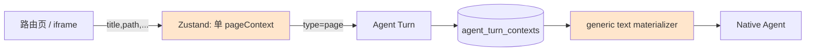
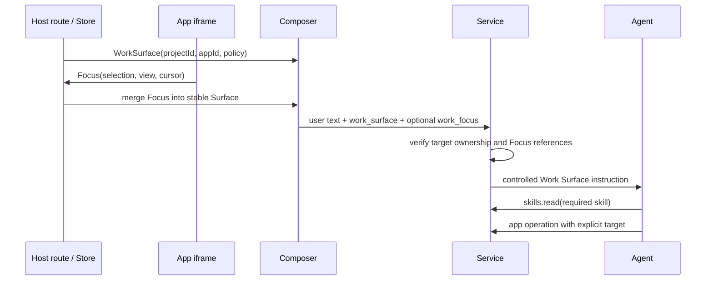

<!--
 * [INPUT]: 依赖 web 的 Agent 面板、路由页与 iframe 宿主桥（agent-panel-context、agent-panel-types、project-detail-client、standalone-app-client）、
 *          service 的 ChatContext 持久化与提示词 materializer（agent.go、agent_server.go）、平台 Guide / MCP / App Skill 契约，
 *          以及现有 Creation World 引用上下文与 recut.editor 的项目工作流
 * [OUTPUT]: 定义平台级 Agent Work Surface Context（工作面上下文）契约：当前工作对象、App 领域、可编辑目标、页面焦点、
 *           用户可见引导、Agent 路由、持久化、迁移与验收标准
 * [POS]: rfc 的跨页面 Agent 上下文设计蓝图；获批后作为 Web 路由、iframe SDK、Service turn 协议、MCP 调度与 App manifest 的共同契约
 * [PROTOCOL]: 变更时更新此头部，然后检查 README.md
 -->

# RFC: Agent Work Surface Context —— 让“当前页面”成为可执行工作面

- 状态：实施中
- 作者：Recut
- 日期：2026-08-16
- 决策范围：工作台路由、项目/World/素材/App 页面、iframe SDK、Agent Turn Context、提示词注入、MCP 目标解析与 App Skill 提示
- 关联：[编辑器 Agent Surface](./2026-08-14-editor-ai-agent-surface.md)、[Creation Worlds 产品重构](./2026-08-14-creation-worlds-product-reframe.md)、[全站 i18n](./2026-08-16-i18n-zh-en.md)
- 实施进展：Phase 0 与 Phase 1 已落地：Web/iframe/Turn 使用分层 Work Surface + 完整 Focus，Editor 已上报时间线选择态；`agentSurface` 仅向 Agent 提供领域与相关 Skill 的上下文提示，不改变 MCP 或原生文件能力范围。跨目标选择器与任何 capability broker 不纳入本 RFC 实施。

## 1. 摘要

“当前页面”不是一枚聊天附件，也不是让 Agent 自己调用 `recut.context` 后猜测的线索。它应是宿主在发送消息时签发的一份**工作面绑定**：告诉 Agent 此刻服务谁、能操作哪个对象、用户所见的局部焦点是什么，以及在歧义词出现时应如何解释。

本 RFC 将现有自由文本 `page` 上下文拆为两层：

1. **Work Surface（宿主拥有）**：稳定身份与默认目标。项目、App、World、素材库和页面模式均由宿主根据真实路由/Store 生成，不能被 iframe 覆盖。
2. **Focus（App 拥有）**：当前选区、子页面、播放头、已选素材及其完整可读状态。它随工作面一并进入本次 Turn，补充而不能改变项目归属、App 或可写范围。

Agent 收到的是结构化、经 Service 校验的 Context；用户收到的是一条人类可读的“将在哪儿工作”的提示。`recut.context` 仍用于能力快照，`workflow.context` 仍用于版本/锁/时间线状态，二者不再承担页面目标解析。

## 2. 背景与病灶

### 2.1 这次事故揭示的不是编辑器局部问题

在 `recut.editor` 项目页，用户请求“HTML 或 React Based assets 组件”“页面底部小元素”。Agent 已经经 `project.list`、`project_context` 和 `workflow.context` 找到正确项目，且返回的 `nextAction` 是 `edit_timeline`。之后它却读取 `apps/editor/ui` 和宿主 Web 源码，误将“页面底部”解释为编辑器应用页面，而非视频画面的下方区域。

问题不在于缺少一个更长的编辑器 Prompt：

- 当前 Turn 实际只收到 `title=8-16`、`path=/projects/<id>`、`url=...`；`projectId`、`appId=recut.editor`、画布/时间线语义均未随消息传递。
- 平台 Guide 把 `recut.context` 定义为能力快照，却同时暴露 App 根目录供原生文件工具访问；模型一旦把请求判为“改 UI”，便能无边界地浏览源码。
- App Skill 明确规定组件创建闭环，但它只是一条文本规则；工具层不记录 Skill 是否已加载，也没有把当前页面解析为目标 App 的强约束。

这会同样伤害 Worlds、素材库、独立 App、项目型 App 和未来所有 iframe，而不只是编辑器。

### 2.2 核心原则

| # | 原则 |
|---|---|
| P1 | **上下文是绑定，不是提示。** 稳定身份以 ID 表达，由宿主签发；Agent 不能把标题、URL 或聊天记忆当身份真相。 |
| P2 | **工作面与焦点分层。** “哪个项目/World/App”永远不能被“选中了什么”覆盖。 |
| P3 | **能力、目标、状态各司其职。** `recut.context` = 能力快照；Work Surface = 当前目标；`workflow.context` = 当前可编辑状态与版本。 |
| P4 | **默认解释贴近所在产品。** 同一词在素材库、时间线和 App 源码的语义不同；解释由工作面类型决定，而不是由模型猜。 |
| P5 | **词义由工作面解释。** “组件”“页面”“模板”“底部”等创作词先按当前产品领域理解，不靠 URL 或源码目录猜测。 |
| P6 | **上下文可见、可移除、可审计。** 用户在发送前看见工作对象；Turn 存储精确的解析结果，调试报告能复现路由。 |

## 3. 现状完整盘点

### 3.1 现有数据契约与传输链

当前 `PageContext` 是五个可选自由文本字段：

```ts
type PageContext = {
  title: string;
  path?: string;
  url?: string;
  selection?: string;
  content?: string;
};
```

发送时前端将其包装为 `{ type: "page", source: "page", payload }`。Service 只验证 `title`，然后把它持久化到 `agent_turn_contexts`；运行 CLI 前，`materializePageContext` 拼成一行：

```text
[当前页面] 标题=<title>；路径=<path>；URL=<url>；选中内容=<selection>；页面内容=<content>
```

这条路径保留了文本，却没有表达“可操作的目标”。任意新增字段还会在 Web 的 `normalizePageContext` 中被丢弃。



两个结构问题：

- `setPageContext` 是**替换**，不是合并。iframe 上报一个局部焦点，会覆盖宿主本可提供的项目身份。
- 所有页面、所有 App、所有来源都折叠为 `type=page`、`source=page`。Agent、UI、日志都无法区分宿主工作面和 App 局部信息。

### 3.2 当前页面生产者

| 页面 / 来源 | 当前发送字段 | 已知但未发送的关键事实 | 当前风险 |
|---|---|---|---|
| 工作台首页的 Projects / Assets / Worlds / Apps Tab | `title`、`path` | 路由类型、素材库的隐藏 scope、当前 Tab 能做什么 | “素材”可被误解为项目素材或全局素材；无默认动作。 |
| 项目详情 `/projects/<id>` | `title`、`path`、`url` | `projectId`、`appId`、App 名称/kind、项目 owner、默认工作模式 | `projectID` 只用于上传素材 scope，不进入 Agent Turn；Agent 必须再列项目猜目标。 |
| World 详情 `/worlds/<id>` | `title`、`path` | `worldId`、当前 revision、active kind、选中的实体/证据 | 同名 World 无法可靠区分；Agent 无法直接走 `recut.worlds.*`。 |
| 独立 App `/workspace-app/<appId>` | `title`、`path`、`url` | `appId`、稳定 workspace scope ID、App kind、可用工作流 | Agent 看见的是一个标题，不知道该加载哪一份 Skill。 |
| 项目 iframe 的 `recut.page.context` SDK | 可上报五个通用字段 | 项目绑定、App identity、结构化 selection、局部时间与模式 | SDK 定义了能力，但仓库内没有实际 emitter；即使 App 上报，宿主也会替换基线。 |
| 独立 App iframe 的 `recut.page.context` SDK | 同上 | App identity、scope、局部焦点 | 同样没有实际 emitter；来源也被标记为 `page`。 |

### 3.3 相邻但不同的上下文

| 类型 | 现状 | 正确定位 |
|---|---|---|
| `media` | 用户主动选择 `assetId`；Service 解析素材真实路径 | 显式素材引用，不是当前页面。 |
| `creation_world` / `creation_entity` | 以稳定 ID 发送，Service 先验证存在，再提示 Agent 用 `recut.worlds.*` 取实时内容 | 本 RFC 的正面样本：身份不是标题，实时详情不拷进 Prompt。 |
| `projectID` Zustand 字段 | 根面板用于素材上传及 UI 引导 | 不能当 Agent 上下文，因为它不进 Turn 也不持久化。 |
| `recut.context` | 新 native session 的能力快照：Apps、Skills、媒体 routes、路径 | 不绑定项目；不可替代 Work Surface。 |
| `workflow.context` | 某 App / Project 的状态、version、lock、allowed actions | 必须用明确目标调用；不负责发现用户当前页面。 |

### 3.4 当前 UI 与可观测性

- Composer 只显示“当前页面 · 标题”，用户无法知道“这条消息会作用于哪个 Project/App/World”。
- 用户能移除 page chip，但无法选择“保留项目身份、移除当前选区”。
- Turn 调试报告保存原始 payload；这足以重放现有文本，却无法判定当时系统是否把 App、目标和解释策略正确带入 Prompt。

## 4. 决策

| # | 决策 |
|---|---|
| D1 | 用版本化、判别联合的 `work_surface` 取代泛化 `page` 作为自动附带的当前页面上下文；保留旧 `page` 仅供历史回放。 |
| D2 | Work Surface 只由宿主生成，含稳定 target ID、owner App、领域和默认意图；iframe 只能上报 `focus`，不能改写 surface。Focus 默认携带发送瞬间的完整选区快照，优先保证判断充分，不以省 Prompt token 为目标。 |
| D3 | Service 在接收 Turn 时校验 Context 与真实对象归属，再签发 Agent 可读的 resolved context；不信任浏览器传来的 App/Project 对应关系。 |
| D4 | Agent Prompt 将 Work Surface 作为独立的受控段落，不再把它混进用户原话或任意 `content` 文本。 |
| D5 | 每个 App 在 manifest 声明紧凑的 `agentSurface` 元数据：领域、默认目标、相关 Skill 与语义路由表。Skill 保留工艺细节，不复制为 manifest 大段 Prompt。 |
| D6 | Work Surface 带出相关 App Skill，帮助 Agent 选择领域工作流；它不是 MCP operation 门禁。 |
| D7 | Work Surface 只提供目标与词义，不改变 App 包、项目 workspace 或原生文件工具的既有能力范围。 |
| D8 | Composer 展示可读工作面，并允许独立开关 Focus；稳定 target 对普通创作请求默认附带。跨目标改为明确选择，而不是让用户删除上下文来猜。 |

## 5. 目标模型

### 5.1 Work Surface：宿主签发的稳定绑定

```ts
type WorkSurfaceContext = {
  type: "work_surface";
  version: 1;
  source: "host";
  surface: "workspace" | "media_library" | "project" | "standalone_app" | "world" | "app_detail";
  title: string;
  route: { path: string; url?: string };
  target?:
    | { kind: "project"; projectId: string; appId: string; appName: string; appKind: "project" }
    | { kind: "app_scope"; appId: string; scopeId: string; appName: string; appKind: "standalone" }
    | { kind: "world"; worldId: string; revisionId?: string; name: string }
    | { kind: "media_library"; scope: "workspace" | "project"; projectId?: string };
  policy: {
    defaultIntent: "browse" | "create" | "project_edit" | "world_review" | "media_manage";
    requiredSkill?: { appId: string; skillId: string };
  };
  issuedAt: string;
};
```

`target` 是身份真相，`title` 只是显示。它的关键不是字段数量，而是 `surface + target + policy` 三元组不可被 App 局部 UI 覆盖。

### 5.2 Focus：App 上报的瞬态局部信息与完整选择态

```ts
type FocusContext = {
  type: "work_focus";
  version: 1;
  source: "app" | "host";
  surfaceKey: string;                 // 与当前 host surface 实例对应，不携带可伪造 target
  view?: string;                      // 例如 "timeline"、"component-library"、"characters"
  selection?: {
    refs: ContextRef[];               // 稳定引用，禁止仅传显示标题
    primaryRef?: ContextRef;
    state: Record<string, unknown>;   // 发送瞬间的完整、结构化选择态
  };
  cursor?: { kind: "time"; seconds: number } | { kind: "none" };
  state?: Record<string, unknown>;    // 当前视图状态，如缩放、筛选、播放模式
  summary?: string;                   // 面向 Composer 与历史的可读说明，不替代 state
  updatedAt: string;
};

type ContextRef =
  | { kind: "timeline_element"; id: string }
  | { kind: "timeline_track"; id: string }
  | { kind: "component"; id: string }
  | { kind: "asset"; id: string }
  | { kind: "world_entity"; id: string }
  | { kind: "world_evidence"; id: string };
```

**完整优先。** 当用户在一个可编辑界面发送消息，当前选择态就是用户指向的对象；它应直接放进本次 Turn，而非因 token 顾虑先缩水为 ID、再迫使 Agent 用数轮工具调用把同一信息读回来。`refs` 负责身份与归属校验，`state` 负责给 Agent 足够的判断材料，二者不可互相替代。

例如编辑器在时间线发送时应至少带入：

```ts
{
  view: "timeline",
  selection: {
    refs: [
      { kind: "timeline_element", id: "el_title_01" },
      { kind: "timeline_track", id: "track_text" }
    ],
    primaryRef: { kind: "timeline_element", id: "el_title_01" },
    state: {
      selectedElements: [{
        id: "el_title_01",
        type: "text",
        name: "标题动画",
        trackId: "track_text",
        startSec: 10.2,
        durationSec: 2.4,
        params: { text: "原生集成", fontSize: 96, color: "#FFFFFF" },
        transform: { x: 0, y: 720, scaleX: 1, scaleY: 1, rotation: 0, opacity: 1 },
        keyframes: [],
        effects: [],
        masks: []
      }],
      selectedTracks: [{ id: "track_text", type: "text", name: "字幕与标题" }]
    }
  },
  cursor: { kind: "time", seconds: 12.4 },
  state: {
    durationSec: 112.383,
    canvas: { width: 2028, height: 2160 },
    playback: "paused",
    activePanel: "assets"
  }
}
```

World、素材库和独立 App 采用同一原则：选中的实体/证据/Asset/表单项应附带其发送瞬间的结构化内容和可见状态，而不是只放标题或裸 ID。大对象、二进制和密钥仍不进入 Turn；但对于已在页面中可见、与用户请求相关的结构化业务状态，默认选择“充分”而不是“吝啬”。

Focus 的 ID 与其包含的对象必须由 owner App / World Store 校验属于当前 target。`summary` 只负责让用户在 Composer 与历史中读懂焦点；它不限制 `state` 的表达能力，也不具有控制权限。

### 5.3 Surface policy：App 把“词义”绑定到产品领域

manifest 新增可选、向后兼容的紧凑声明：

```json
{
  "agentSurface": {
    "domain": "timeline-editor",
    "defaultIntent": "project_edit",
    "requiredSkill": "recut-editor",
    "semanticRoutes": [
      { "terms": ["html", "react", "r3f", "shader", "组件", "动效"], "intent": "timeline_component" },
      { "terms": ["页面底部", "底部元素"], "intent": "canvas_lower_safe_area" }
    ]
  }
}
```

这不是把创作知识塞进 manifest。它只声明**工作面解释与边界**；组件写法、镜头审美、工具调用顺序仍由 `recut-editor` Skill 负责。

### 5.4 当前页面的目标映射

| 工作面 | target | 默认意图 | App/Agent 解释 |
|---|---|---|---|
| Projects Tab | 无 | `browse` | 浏览、创建或选择项目；未明确项目时不写任何项目。 |
| Media Library | `media_library`（可选 project scope） | `media_manage` | 搜索、整理、上传、生成、关联素材；不能暗示编辑任一项目。 |
| Worlds Tab | 无 | `browse` | 浏览或创建 World；不把“Worlds”标题当成某个 World。 |
| World Detail | `worldId` + 可选 revision | `world_review` | 读当前 World；写 World 仍遵守提议→用户确认契约。 |
| App Detail | `appId`，无 writable project | `browse` | 了解/安装/更新 App；不得把它误作项目编辑面。 |
| Standalone App | `appId` + `scopeId` | App 声明的 default | 加载该 App Skill，操作其稳定 scope，不创建虚构项目。 |
| Project App | `projectId` + `appId` | App 声明的 default | 加载该 App Skill，以该 projectId 为 operation target。 |
| `recut.editor` Project App | `projectId` + `recut.editor` | `project_edit` | HTML/React/R3F/shader/组件 = 项目内可验证视觉组件；“画面/底部” = 画布区域；改 App UI 必须显式。 |

## 6. 端到端协议



### 6.1 Prompt 形态

Service 不再把页面信息仅作为普通附录，而是生成受控区段：

```text
<recut-work-surface version="1">
Current work surface: Project App / Recut Editor
Target: projectId=prj_123; appId=recut.editor
Default intent: project_edit.
Interpret HTML, React, R3F, shader, component, animation as timeline visual-component work.
Interpret “bottom” as the video canvas lower safe area.
Relevant skill: recut.editor/recut-editor.
</recut-work-surface>

<recut-work-focus>
view=timeline; playheadSec=12.4
selection.refs=[timeline_element:el_title_01, timeline_track:track_text]
selection.state={完整的已选元素、轨道、参数、transform、关键帧、效果、蒙版}
surface.state={画布、总时长、播放状态、当前面板}
</recut-work-focus>
<user-request>...</user-request>
```

这段内容是系统解析后的事实与策略，不是页面 `content` 直接拼接。这样既能解释歧义，也不把用户的创作要求伪装成系统指令。

### 6.2 工具调用纪律

对于有 target 的工作面：

1. 新 native session 才读取一次 `recut.context` 能力快照；不因当前页面再做项目列表漫游。
2. 从 Work Surface 直接得到 `appId`、`projectId`、required skill；先 `recut.skills.read`。
3. 先使用 Work Surface 与完整 Focus 完成目标、选区和局部参数判断；仅在需要未附带的实时全局状态、并发版本或工作面外对象时，才用显式 `__recut.target.projectId` 调 `workflow.context` / 细节读取工具。
4. Work Surface 只解释当前项目的领域语义；它不收紧 Agent 对既有 App package、项目 workspace 或原生文件工具的访问范围。

以编辑器组件为例，首条有效路径是：

```text
skills.read(recut.editor/recut-editor)
→ editor.workflow.context(target projectId)
→ editor.timeline.read(target projectId)
→ editor.component.define
→ editor.component.verify
→ editor.component.list
→ editor.timeline.command(insert)
→ editor.timeline.validate / visual verification
```

### 6.3 校验与失败语义

| 校验 | 位置 | 失败行为 |
|---|---|---|
| target 存在、属于 app | Service 接收 Turn / 解析 surface | 丢弃伪造 target，回退为无 target 的安全浏览上下文，并记录审计。 |
| Focus 引用属于 target | Service 或 owner App resolver | 移除失效 Focus，保留稳定 Work Surface；不阻断用户消息。 |
| baseVersion / aiLock | owner App workflow | 沿用 App 现有冲突与锁恢复流程；Work Surface 不替代运行时状态。 |

相关 Skill 是丰富的领域提示，不作为 session、MCP 或文件能力的额外约束。

## 7. 用户体验

### 7.1 Composer 的工作面卡

默认显示一张不可误解的卡，而非只有标题的 chip：

```text
正在编辑
剪辑器 · 项目「8-16」
请求默认会应用到此项目的时间线
```

有 Focus 时单独显示：

```text
当前焦点：时间线 · 12.4 秒 · 选中「标题动画」
（本次将一并发送该元素的完整可编辑状态）
```

- 用户可移除 Focus；稳定 Work Surface 在项目工作面默认保留。
- 用户可通过“更改目标”切到别的项目/World，而不是删除上下文后让 Agent猜。
- 进入“修改 App 源码”模式需要显式选择并显示警告：`将修改剪辑器 App 包，而非当前视频项目`。

### 7.2 面向用户的简短引导

提示不是教用户调用 `context`，而是减少其表达成本：

| 工作面 | 例子 |
|---|---|
| 剪辑项目 | “在画面底部加一个 React 提示组件”；“把当前选中的标题做成 shader 效果”。 |
| 素材库 | “找三段适合转场的城市夜景”；“整理重复素材”。 |
| World | “总结这个角色当前的外貌约束”；“提出一条新规则，先别写入”。 |
| App 源码模式 | “修改剪辑器 UI：给素材面板增加筛选”。 |

## 8. 迁移计划

### Phase 0：盘点与契约落地

- 新增 `WorkSurfaceContext` / `FocusContext` TS 与 Go schema，保留 `PageContext` 读取兼容。
- 给四类宿主路由生成 stable Work Surface：工作台 Tab、项目详情、World 详情、独立 App；补 App Detail 与素材库 scope。
- 替换自由文本 `normalizePageContext` 为带长度、枚举与 ID 格式校验的 normalizer。
- 在 Turn 调试报告中显示 `surface`、`target`、`policy`、Focus 校验结果与解析后的 agent instruction。

### Phase 1：项目与 iframe 分层

- Project Detail 始终产生 project Work Surface；iframe `page.context` 升级为 `recut.focus.report`，只上报 Focus。
- Standalone App 同理，稳定 scope 不允许被 iframe 替换。
- 扩展 iframe SDK 与中英文文档；升级编辑器和 Vox B-roll 为首批 emitter（时间线选择 / 场景选择）。
- Composer 改为“工作面 + Focus”双卡，提供移除 Focus 与更改目标。

### Phase 2：Agent 路由与上下文提示

- manifest 增加 `agentSurface`，先为 Editor、Vox B-roll、Remotion Studio 编写最小领域提示。
- 将 App Skill、编辑器“组件/底部”语义与当前 project target 一并给 Agent，减少由 URL、标题或源码目录猜测意图。
- 不收紧原生文件工具、MCP operation 或 App 的既有全局能力范围。

### 后续候选：完整的目标选择

- Composer 支持跨项目/跨 World 明确选择 target，并将其签发为新 Work Surface。
- 为第三方 App 提供 manifest schema、SDK fixtures 与 contract test，不要求一次性迁移所有 App。

## 9. 兼容、隐私与安全

### 9.1 兼容

- 历史 `type=page` Turn 原样读取、显示为“旧版页面上下文”；不迁移或篡改历史审计。
- 未声明 `agentSurface` 的第三方 App 使用 `standalone_app/project` 通用 policy，只提供 target identity，不做领域语义重写。
- 旧 iframe `recut.page.context` 在 Phase 1 继续接受，映射成无稳定 ID 的 Legacy Focus，并永远不能覆盖 Host Work Surface。

### 9.2 隐私与内容边界

- Work Surface 持久化稳定 ID、短标题、路由种类与策略；不要复制项目全量内容、素材本地路径或机密设置。
- Focus 保存稳定 ID 与发送瞬间、用户可见的完整结构化业务状态；不因 Prompt token 预算截断与当前请求直接相关的选区。详情只在需要工作面外对象、当前状态已过期或需做服务端校验时再由 owner 工具读取。
- 任何 App 传来的文本都不具备改变稳定 target 或 App 归属的能力；target 与 Skill identity 均由 host/service 重新解析。

### 9.3 不做什么

- 不把当前页面自动绑定为 Agent session 的永久目标；每个 Turn 保存自己发送瞬间的 Work Surface，避免切页后污染后续消息。
- 不让 Work Surface 绕过用户对 World 写入、媒体生成、安装/更新的既有授权规则。
- 不把 App Skill 全文塞进页面 Context；Skill 仍按需读取。
- 不以关键词分类器代替领域契约；关键词只是 `agentSurface` 语义路由的有限输入。

## 10. 验收标准

### 10.1 契约测试

| 场景 | 断言 |
|---|---|
| 项目页发送 | Turn 含 `work_surface.target.projectId/appId`；不需要 `project.list` 才能锁定目标。 |
| iframe 上报 Focus | project target 不变；Focus 无法覆盖 appId/projectId；已选对象的可编辑状态（参数、transform、关键帧等）完整进入 Turn。 |
| World 详情发送 | Turn 含真实 `worldId`；Agent 可直接走 `recut.worlds.get`。 |
| 素材库发送 | 是 workspace/project media scope，不携带任意项目写权。 |
| 旧 page payload | 仍能读取、显示、调试；不获得新策略或 target 权限。 |
| 无效/越权 Focus | 被剔除并审计，用户消息仍可执行。 |

### 10.2 Agent 行为测试

| 请求 | 工作面 | 必经路径 | 禁止路径 |
|---|---|---|---|
| “做一个 React 组件放画面底部” | editor project | Work Surface 解释为 timeline visual component，Focus/工作流提供下一步所需状态 | 把“底部”仅按浏览器 URL 或页面标题解释。 |
| “修改剪辑器素材面板 UI” | editor project | Work Surface 说明当前项目与编辑器领域，按用户请求选择合适的 App 或项目工作流 | 把该请求误写入当前时间线组件。 |
| “把当前镜头加速” | editor project + element focus | 直接依据 Focus 中的元素、时间与 rate 状态规划，再做必要的 version/校验读取 → timeline command | 根据标题猜 element ID，或为已附带的选区重复漫游读取。 |
| “总结这个角色的外貌” | World detail + entity focus | worlds entity get/resolve | 用页面标题臆造 World。 |

### 10.3 可观测性指标

- 有 target 的 Turn 中，首次有效 owner-App operation 不再以 `project.list` 为前置的比例。
- 有相关 Skill 提示的 Turn 中，首次匹配领域工作流的工具数与耗时。
- 用户发送前移除 Focus、变更 Work Surface 的比例，用于评估默认路由是否符合直觉。
- 从用户发送到第一次 domain operation 的工具数与耗时。

## 11. 开放问题

1. 跨项目/跨 World 的明确目标选择应如何呈现，才能不增加普通创作请求的表达成本？
2. `agentSurface.semanticRoutes` 是否应支持多语言 term 表，还是由 App Skill / locale dictionary 在运行时给出？建议 manifest 只存稳定 intent，文本词表放 locale-aware 服务端 policy。
3. Focus 指向的 timeline 元素在用户发送到 Agent 执行之间可能删除。建议 owner App 返回 `stale-focus`，Agent 读时间线后重新选择，而不是静默把操作落到同名元素。
4. 目标切换是否应创建新的 Agent session？本 RFC 保持单 session、按 Turn 固定上下文；若历史混乱，再单独设计 session 分支 UX。

## 12. 结论

好的上下文不要求用户会描述系统，也不要求模型从 URL 猜系统。它让“我正在这个页面”收敛为“请在这个真实对象上，以这个产品语义完成工作”。

Work Surface 是目标的单一真相；Focus 是局部视线；Skill 是工艺；workflow 是实时状态。四者各自清楚，Agent 才不会把做视频组件的请求带去改一个 App 的网页。
