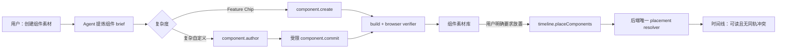
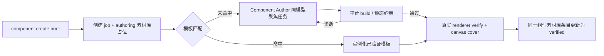

<!--
 * [INPUT]: 依赖 recut.editor 的 AI 组件持久化与构建链（background/）、组件素材库与 runtime resolver
 *          （ui/src/recut/components.ts、assets/views/component-library.tsx）、时间线 MCP command，以及 Agent Work Surface Context。
 * [OUTPUT]: 定义“组件素材先入库、显式后落轨”的用户语义、快速创建与可信验证管线、统一的时间线避碰放置契约。
 * [POS]: rfc 的编辑器 AI 组件工作流蓝图；获批后约束 Editor MCP、浏览器 verifier、组件素材库、时间线 placement 与 Agent 能力边界。
 * [PROTOCOL]: 变更时更新此头部，然后检查 README.md
 -->

# RFC: 组件素材工作流——先入库、快创建、再显式落轨

- 状态：已实施（v1）
- 作者：Recut
- 日期：2026-08-16
- 决策范围：`recut.editor` 组件素材库、AI 组件 MCP、浏览器/服务端验证、Agent 工具权限、时间线插入与轨道放置
- 关联：[AI 临时组件](./2026-08-14-ai-temp-components.md)、[编辑器 Agent Surface](./2026-08-14-editor-ai-agent-surface.md)、[Agent Work Surface Context](./2026-08-16-agent-work-surface-context.md)、[Visual Runtime Component System](./2026-08-13-visual-runtime-component-system.md)
- 实施进展：Feature Chip 快速路径、受限同模型 Component Author、`component.revise` 调整闭环、浏览器验证/封面、原子避碰 placement 已实施；受管 headless verifier 与通用 creation job 留作后续。

## 1. 摘要

组件是可执行的视觉素材，不是时间线 clip 的别名。创建默认进入组件素材库，绝不需要“创建后再存放”的第二次 Agent 调用，也绝不改变时间线。v1 有两条清晰路径：受信 `feature-chip` 参数化模板走一次 `component.create`；复杂视觉走一次 `component.author`，同模型受限 Author 通过唯一 commit 工具提交候选。只有用户明确要求“放到视频中 / 放到第 N 秒 / 替换选中元素”时，才进入独立的放置步骤。

本 RFC 收敛三个互相放大的缺陷：

1. **意图混淆**：Agent 将创建组件后的默认下一步理解为插入时间线；用户在普通「素材」页又看不到组件，以为素材没有创建。
2. **创建路径过重**：一次简单装饰组件创作让通用 Agent 研究 harness、轮询、写临时文件、驱动浏览器，再自行提交验证报告；四个同模板 chip 被构建和验证四次。
3. **MCP 放置无避碰**：四个同一时段的 `graphic` clip 被塞进同一条轨。前端有避碰逻辑，MCP 后端却只复用第一条同类型轨道，导致时间线只显示一条重叠长片段，层级顺序也变成隐式副作用。
4. **素材库缺少视觉入口**：组件条目没有以真实渲染结果生成封面，用户无法从图库快速判断它是什么。

目标状态是：**创建即入库；验证只改变素材状态；放置才改变影片。** 组件生成最快只需一次 MCP 调用；时间线放置只由一个后端规则引擎决定。



## 2. 事故与根因

### 2.1 用户看到的行为

用户请求创建四个用于视频底部提示的 HTML/React 装饰组件。会话最终出现四条看似成功的时间线插入，但编辑器时间线上只看到一条片段；截图打开的普通「素材」页中也只显示媒体文件。

### 2.2 事实链

调试会话表明：

| 事实 | 结论 |
|---|---|
| 首次 `timeline.command insert` 在组件尚未验证时被后端拒绝 | `component.define` 本身没有隐式落轨。 |
| 组件验证成功后，Agent 又明确执行四次 `timeline.command insert` | 是 Agent 把创建任务延伸为时间线编辑，而不是组件 API 偷偷写入时间线。 |
| 四次 insert 都是 `trackType: "graphic"`，均从 `0s` 持续至片尾，未指定 `trackId` | 它们必然在时间维度冲突。 |
| MCP 后端 `findOrCreateTrack` 返回第一条相同类型轨道，不检查 span overlap | 四个 clip 被写到一条 graphic 轨，视觉上重叠为一条。 |
| UI 的放置器已有 `firstAvailable` / `canPlaceTimeSpansOnTrack` | UI 与 MCP 有两份行为不同的 placement 规则。 |
| 已验证 AI 组件出现在顶部「组件」分类，而不是「素材」媒体分类 | 数据模型是正确的，但用户可见命名和完成反馈不足。 |

### 2.3 根因不是单个 bug

当前系统把一条创作需求拆成了不该由 Agent 承担的机械闭环，同时让时间线写入拥有过大的默认权力：

```text
自然语言
  → 通用 Agent 读技能 / 猜下一步
  → component.define
  → Agent 等待并寻找浏览器 harness
  → Agent 伪装为 verifier 回传 report
  → Agent 自主决定 timeline.command
  → MCP 另一套放置逻辑写入第一条 graphic 轨
```

这既慢，也让每一步的语义难以审计。正确的边界应由工具和状态机表达，而不是依赖模型每次读对一段说明文字。

## 3. 目标与非目标

### 3.1 目标

1. 一次组件创建调用原子写入组件素材库条目，项目时间线版本与 command log 均不变化；不需要 Agent 的后续“存入素材库”调用。
2. 用户能清楚知道组件保存于「组件素材」；它不是普通视频/图片/音频 Asset。
3. 模板组件一次 `component.create` 即可实例化、验证并发布；自定义组件不需要 Agent 自行驱动浏览器 harness。
4. 验证报告只能由受信任的 verifier 写入，Agent 不能凭空声明“已渲染通过”。
5. UI、MCP、未来 API 使用同一份轨道兼容与时段避碰规则。
6. 同时段的四个 graphic 组件默认落到四条可读的 graphic 轨；不重叠的组件可以复用轨道。
7. 一组组件的放置是原子的：失败时不留下半组 clip，也不要求 Agent 维护连续 `baseVersion`。

### 3.2 非目标

1. 不把 AI 组件伪装成全局媒体 Asset；它仍是项目作用域、可执行、带版本的组件素材。
2. 不在本 RFC 处理页面上下文质量；Work Surface Context 负责该问题，本 RFC 只消费其“组件创作 / 时间线编辑”意图。
3. 不把 Component Author 暴露为用户可见的聊天会话，也不允许它取得时间线、文件系统或通用 shell 权限。
4. 不重做 Visual Runtime 的 HTML、React、R3F surface 契约。
5. 不把模板库扩展为通用的 UI 设计系统；首期仅覆盖高频、参数化的剪辑装饰件。

## 4. 设计原则

| # | 原则 |
|---|---|
| P1 | **素材与实例分离。** 一个组件定义可以有零个、一个或多个时间线使用点。 |
| P2 | **默认无副作用。** “创建”只改变素材库；改变影片必须有单独、可见的放置意图。 |
| P3 | **创建是一个闭环工具。** 主 Agent 只作一次创建调用；复杂路径由受限 Author 的唯一 commit 交付源码，编译、验证、封面和入库不再泄漏为主 Agent 的机械步骤。 |
| P4 | **模板优先于重复生成。** 相同视觉骨架的差异应是参数或实例，不是四份源码。 |
| P5 | **placement 单一真相。** overlap、兼容性、新轨顺序不能在 UI 和 MCP 各实现一次。 |
| P6 | **批量操作必须原子。** 多个元素的布局要基于同一个 project version 与同一份计划中的占用区间。 |
| P7 | **能力按意图缩小。** 组件创作路径没有时间线写权限；放置路径才拥有它。 |
| P8 | **先给简单组件最快路径。** 低复杂度 HTML 装饰件走单次、低上下文的 Fast Author；只有构建/验证失败或需求复杂时才升级为完整 Author。 |

## 5. 核心决策

| # | 决策 |
|---|---|
| D1 | 顶部分类改为「组件素材」（英文 `Components`）；普通「素材」继续只展示媒体。组件创建完成后给出可点击的库内定位，不自动切走用户当前面板。 |
| D2 | 主 Agent 按复杂度只调用一次：`component.create({items})` 用于受信 `feature-chip`，`component.author({brief})` 用于复杂自定义视觉。两者都只创建组件素材，绝不放置时间线。 |
| D3 | 模板调用同步构建并发布 `verified`；复杂调用返回 `draft`，打开的编辑器自动进行 `draft → verifying → verified | failed`。没有“存放入库”的后续 Agent 调用。 |
| D4 | 高频视觉以已验证 `feature-chip` 模板作为快速路径。文字、颜色、图标是 params；批量 items 在一个调用中完成，避免 N 次模型/构建回合。 |
| D5 | `timeline.placeComponents` 是唯一的组件落轨批量入口。它要求明确 placement intent，接收一组已验证 componentId 与实例参数。 |
| D6 | 后端实现 canonical placement resolver，按元素时间区间选择 `firstAvailable` 轨或创建新轨；UI 改为调用或复用该相同算法，不再保留分叉副本。 |
| D7 | `component.author` / `component.revise` 启动同模型 General Author：复用发起会话的 model/reasoning，却没有父对话历史、项目文件、shell 或时间线工具。它只有一次 `recut.editor.component.commit` 工具调用，平台借此执行 `component.define`；revise 还携带 baseVersionId 防止旧版本覆盖新 head。 |
| D8 | verifier 在同一次真实渲染中用 HTML-in-Canvas / WebGL canvas 导出 PNG 封面；`component.resolve` 将 cover URL 注入 runtime，组件素材卡片优先显示它。封面不混入普通媒体素材库。 |

## 6. 用户语义与状态模型

### 6.1 两种显式动作

| 用户动作 | 结果 | 可写范围 |
|---|---|---|
| “创建 / 做一个组件素材 / 保存为组件” | Feature Chip 一次 `component.create` 即 verified；复杂视觉一次 `component.author` 创建 draft，编辑器自行验证后变为 verified | 仅 components 表、私有 bundle/cover 文件 |
| “放到视频 / 第 5 秒放置 / 替换选中元素” | 从已验证组件生成一组时间线实例 | 时间线 document 与 command log |

“页面底部”“用于视频”“作为提示元素”描述视觉用途，**不构成落轨授权**。只有明确的放置动词、时间/选区，或 Composer 中用户选择的“同时放入时间线”开关，才生成第二种动作。

### 6.2 组件生命周期

```text
feature-chip: create → build → verified
custom: component.author → component.commit → draft → browser verify → verified
                                                        └→ failed（旧 verified head 不受影响）
```

两条路径都在创建时写入项目私有组件素材库；复杂路径在 `component.commit` 后留下可恢复的 draft，打开编辑器或重连时会扫描 draft 并验证。每个 `componentId` 可持有多个版本；时间线只解析最新 `verified` head。新版本验证失败前绝不覆盖旧 head。

### 6.3 UI 完成反馈

成功创建后，聊天工具结果与编辑器 toast 均返回：

```text
已保存到组件素材 · FeatureChip · 已验证
[在组件素材中查看]  [放入时间线]
```

“放入时间线”是用户主动点击后的新命令，不是创建后的后台副作用。组件素材 Tab 显示计数与最近创建的高亮项，消除“素材是否消失”的误解。

### 6.4 真实渲染的组件封面

`html` 与 `react` surface 已经通过 HTML-in-Canvas 被捕获到画布；`r3f` 也由同一个 scene canvas 渲染。verifier 在检查 `render`、`mounted`、`content` 的同一过程，按固定 capture spec 调用 canvas 导出 WebP/PNG：

```ts
type ComponentCoverSpec = {
  width: 640;
  height: 360;
  timeSec: 0.6;                 // 固定且可复现的预览时刻
  params: "defaults" | Record<string, string | number | boolean>;
  background: "transparent" | "checkerboard";
};
```

封面以版本 id 写入项目私有 `components/covers/<versionId>.png`；代码或默认参数改变会产生新版本和新封面。`component.list` 与 `component.resolve` 返回 `coverUrl`，组件素材卡片直接显示真实视觉而不是纯色名称块。

这张图的默认身份是 `ComponentVisualCover`：它随组件版本生命周期存在，是组件素材库的派生预览，不是用户可剪辑的视频/图片媒体，也不占用普通「素材」页。用户明确选择“导出组件封面为图片素材”时，才以 `origin: "component-cover"` 创建一个正式 image Asset；该显式导出可被时间线、项目封面或其他 App 复用。

## 7. 后续：通用 Component Creation Job（未实施）

本节是 v2 的候选收敛方案，不描述当前 MCP surface。当前实现以「`component.create` 的受信 Feature Chip 快速路径 + `component.author` / `component.revise` 的同模型工具调用路径」交付；不假称已有通用 creation job、`component.cancel` 或 headless renderer。

### 7.1 主 Agent 只有一次创建调用

主 Agent 不写 `source`，不读组件源码，不调用 `component.verify`，不轮询 harness，也不调用“存入素材库”。它把用户请求压缩为结构化 brief，发起**一次**批量 creation job：

```ts
component.create({
  items: [
    {
      nameHint: "Remotion Native Agent Chip",
      brief: "画布底部的小型横向提示牌：Remotion 图标、主标题‘原生集成 Remotion’、副标题‘本地 Agent 驱动’，青色重点，克制的入场动画。",
      role: "bottom-feature-chip",
    },
    {
      nameHint: "Shader Choice Chip",
      brief: "与上一项同系列，但强调 Shader 特效和粉色重点。",
      role: "bottom-feature-chip",
    },
  ],
  references: {
    componentIds: ["optional-existing-component"],
    assetIds: ["optional-image-reference"],
  },
  design: { canvas: { width: 2028, height: 2160 }, locale: "zh-CN" },
});

// 立即返回：
// { creationJobId, components: [{ componentId, status: "authoring", libraryItem }], status: "running" }
// 终态事件：
// { creationJobId, components: [{ componentId, versionId, status: "verified", coverUrl }] }
```

`items` 是批量而不是 N 次单组件调用。它让 Author 在同一设计上下文中决定：哪些只是同一模板的不同 params，哪些必须是独立组件；主 Agent 的成本始终是一条 tool call。

`component.create` 不接受 `source`、`templateId`、`report`、`placement` 或 `trackId`。这些都是工具内部实现细节，暴露它们必然把机械流程重新推回通用 Agent。

### 7.2 Creation Job：工具内部的完整流水线



1. **占位先入库**：工具事务创建 `creationJob` 及每个 `componentId` 的 `authoring` 条目。用户立即在「组件素材」看到进度；这不是后续 Agent 存放动作。
2. **模板匹配**：平台用 `role`、brief、已有组件与参数需求选择已验证模板。命中时直接实例化参数，不调用模型、不重复构建、不重复验证源码。
3. **Author 调度**：未命中项先经复杂度路由，选择 Fast Author 或完整 Author；两者均使用发起会话相同的 runtime/model 配置，却不继承父 Agent 的漫长聊天、工具历史或文件系统。
4. **受管修复**：平台编译和 verifier 把结构化 diagnostics 返给同一 Author，最多两次窄修复。修复只允许补丁当前候选，禁止重新探索仓库、重述用户需求或生成时间线操作。
5. **真实验证与封面**：通过 build 后，平台 renderer 验证精确 bundle，并从同一 canvas 导出封面。成功才将已有条目转为 `verified`；失败条目保留诊断和“重试创建”入口。

整个 pipeline 是**一个可取消、可观测的 tool job**。主 Agent 可以立即结束回复；如果用户明确要求本回合放置，`timeline.placeComponents` 可等待给定 `creationJobId` 的 verified 结果，但创建本身绝不需要第二次 Agent call。

### 7.3 Fast Author：简单组件必须尽快产出

`component.create` 在 job 内先作确定性复杂度分类。以下条件同时满足时走 Fast Author：

- `role` 属于 chip、badge、label、pill、lower-third、CTA、静态卡片等已知 2D 装饰件；
- 偏好 `html` surface，且不涉及 shader、R3F、外部媒体、复杂交互或多阶段编排；
- 输入不超过 8 个标量 params，单个 visual footprint 可由一个基础尺寸和稳定 content bounds 表达。

Fast Author 不执行目录/Skill/源码探索，也不调用检索工具。平台将匹配的 HTML skeleton、颜色/排版 token、`@recut/runtime` 契约与用户 brief 拼成一个很小的 prompt；同模型以最低可用推理档位只输出一个 `ComponentAuthorOutput` JSON。它只有一次生成机会：

```text
brief + skeleton + contract → 单次源码输出 → build → verify
```

模板命中比 Fast Author 更快，零模型调用；Fast Author 适用于“还没有模板、但形状足够简单”的组件。首次 build/verify 失败时，job 自动提升为完整 Author，而不是让主 Agent 接手诊断。首期性能预算：模板命中应近乎即时返回；Fast Author 的源码输出目标为 5 秒内开始、12 秒内完成；完整 Author 才允许两轮修复。

### 7.4 Component Author 的最小上下文与输出契约

Component Author 使用与父会话相同的模型配置，目的在于保持能力和风格，不是复制整个通用 Agent。它的输入被收敛为一个 `ComponentAuthorPacket`：

```ts
type ComponentAuthorPacket = {
  item: { nameHint?: string; brief: string; role?: string };
  projectVisualContext: { canvas: { width: number; height: number }; locale: string };
  selectedReferences: Array<{ kind: "component" | "asset"; id: string; summary: string }>;
  runtimeContract: {
    allowedSurfaces: ["html", "react", "r3f"];
    allowedImport: "@recut/runtime";
    required: ["inputs", "render", "getBaseSize", "getContentBounds"];
    deterministic: true;
  };
  curatedExamples: Array<{ role: string; source: string }>;
};

type ComponentAuthorOutput = {
  name: string;
  surface: "html" | "react" | "r3f";
  keywords: string[];
  inputs: ParamDefinition[];
  source: string;
  coverSpec?: ComponentCoverSpec;
};
```

它拥有的唯一“工具”是只读的模板/参考检索；没有 `timeline.*`、`component.publish`、shell、读目录或任意文件写能力。持久化由 creation job 执行，Author 永远无法把一个组件直接放入时间线。

这一窄上下文替代本次事故中的十余次“读 skill → 找 harness → 看源码 → 写临时脚本”探索。真正需要模型的部分只有设计和代码；已知契约、参考、编译和验证都由平台直接提供。

### 7.5 组件调整同样是一条调用

用户说“把刚才的 chip 更圆一些 / 改成紫色 / 修复溢出”时，主 Agent 只调用：

```ts
component.revise({
  componentId: "cmp-shader-chip",
  instruction: "圆角增大到胶囊感，主色改为 #A78BFA，保持尺寸和动效。",
});
```

工具内部读取当前 verified source、params、封面与最近 verifier diagnostics，交给相同能力边界的 Author 生成最小补丁，随后重复 build → verify → cover → head 更新。主 Agent 不需要 `component.source`、重新 define、人工提交 report 或查 versionId。旧 verified head 在新版本成功前持续可用。

### 7.6 可信验证边界

当前让 Agent 向 `component.verify(report)` 上传“我已渲染成功”的报告，既昂贵又不可信。新模型将其拆分：

| 调用者 | 能力 |
|---|---|
| 主 Agent MCP | `component.create`、`component.revise`、`component.get`、`component.cancel` |
| Component Author | 仅只读模板/参考检索，输出候选 JSON |
| 浏览器 verifier / 平台 job worker | 读取精确 `versionId` bundle、真实渲染、写入 verifier result 与 cover |
| 组件素材库 UI | 订阅 job/版本状态、展示诊断、请求预览 |

verifier 的结果写入必须携带平台签发的 job capability，不能由普通 MCP token 调用。浏览器是首期实际渲染环境时，由编辑器 iframe 接到 `verificationRequested` 事件后加载精确版本并回传；无活动 iframe 时，平台排队到受管 headless renderer。两种实现输出同一 `VerificationReport`，并在成功时使用同一 canvas 生成 `ComponentVisualCover`。

### 7.7 批量显式放置

```ts
timeline.placeComponents({
  baseVersion: 141,
  sceneId: "main-scene",
  placement: { strategy: "firstAvailable", trackType: "graphic" },
  items: [
    { componentId: "cmp-remotion", startSec: 0, durationSec: 112.38, params: { /* ... */ } },
    { componentId: "cmp-template", startSec: 0, durationSec: 112.38, params: { /* ... */ } },
    { componentId: "cmp-shader", startSec: 0, durationSec: 112.38, params: { /* ... */ } },
    { componentId: "cmp-library", startSec: 0, durationSec: 112.38, params: { /* ... */ } },
  ],
});

// → { ok: true, version: 142, refs: [{ trackId, elementId }, ...] }
```

该操作先检查所有组件都处于 `verified`，再用同一份 project snapshot 对全组元素规划轨道，最后一次写入 project 与 command log。任何组件不存在、未验证、版本冲突或参数无效，都不产生部分插入。

## 8. Canonical Placement Resolver

### 8.1 输入与确定性规则

resolver 的输入是 `(scene tracks, planned inserts, placement strategy)`；时间 span 从每个 element 的 `startSec + durationSec` 推导，不能由调用方省略。

`firstAvailable` 的规则：

1. 按请求 items 顺序稳定处理；同一批次之前已规划的元素同样占用轨道。
2. 在同类型轨中寻找首条与目标 span **完全不重叠**的轨。
3. 找到则复用；否则创建一条同类型轨，插入到该类型可读层级的最高位置。
4. 显式 `trackId` 是唯一允许同轨覆盖的方式；对普通 graphic/text/video 插入，重叠时返回结构化冲突而不是静默叠放。
5. effect 轨、主视频轨和音频轨沿用其自身兼容性规则，但同样由同一 resolver 判定。

因此本事故的四个 `0s–112.38s graphic` items 会分配到四条 graphic 轨；若它们改为相邻的 `0–5s`、`5–10s`、`10–15s`，则可以复用同一条轨。

### 8.2 唯一实现位置

当前 UI 的 `resolveTrackPlacement` 与 MCP background 的 `findOrCreateTrack` 语义分叉。获批后：

- resolver 移至编辑器共享 domain 层，并以纯函数测试固定；
- MCP 后端调用它作最终裁决；
- UI 拖拽与“添加到时间线”调用它的同一实现或通过 API 请求同一结果；
- 不保留“UI 会避碰、Agent MCP 不避碰”的兼容分支。

这不是代码复用的小优化，而是项目 document 的一致性边界：谁写入 document，谁必须遵守同一条布局法律。

## 9. 后续 Author 扩展：同模型、不同任务面

创建组件确实需要一个聚焦 Agent；问题不在“是否使用同一个模型”，而在于不能让父 Agent 先自己探索整个工程、再把零散步骤拼起来。

当前 `component.author` 已使用发起会话相同的 model / reasoning configuration，但它不是父会话的 resume，也没有完整聊天历史；它通过唯一 commit 工具交付候选。下表所述 batch、修复和可取消 job 是后续扩展：

| 父 Agent | Component Author |
|---|---|
| 理解用户总体目标，发起一条 `component.create` | 只理解一个或一组组件 brief，选择模板或生成候选源码 |
| 不读源码、不等验证、不写临时脚本 | 只读 curated contract / examples / explicit references |
| 没有组件内部实现循环 | 接收最多两轮结构化 build/verifier diagnostics 并做窄修复 |
| 只有用户明确要求时才调用时间线放置 | 没有任何 `timeline.*` capability |

这不是把通用 Agent 藏进一个黑箱，而是把原本散落在 42 次工具调用中的确定性工作收敛到一个可观察的 creation job：用户仍能在同一聊天看到 `authoring`、`building`、`verifying`、`verified`，也能取消或重试；主 Agent 却不再为每个组件重复读文档、找 harness 与维护版本号。

模板命中不启动 Author；自定义设计才启动。四个同系列 Chip 应优先作为一份 batch brief 交给一个 Author，这样它可直接复用一个 `FeatureChip` 骨架并只变化 params，而不是让四个独立 Agent 回合各自发明一次相同组件。

## 10. 数据、事件与审计

### 10.1 新增逻辑记录

```text
ComponentVersion
  versionId, componentId, source/bundle/templateRef, inputs
  status: authoring | building | verifying | verified | failed
  creationJobId, verifierKind, verificationReport, coverHash, coverSpec, verifiedAt

ComponentCreationJob
  creationJobId, projectId, requestedItems, authorModel, status
  route: template | fast-author | full-author, templateHits, componentIds
  attemptCount, firstOutputMs, diagnostics, createdAt, completedAt

ComponentPlacementBatch
  batchId, projectId, baseVersion, strategy, itemCount
  plannedRefs, resultingVersion, status, createdAt
```

### 10.2 事件

```text
project.component.creation  { creationJobId, componentIds, route, status: authoring | building | verifying | verified | failed }
project.components.changed  { componentId, versionId, status, origin: template | author }
project.component.verified  { componentId, versionId, creationJobId }
project.timeline.changed    { version, source: "component-placement", batchId }
```

每个 Agent tool result 记录 `intent: "library" | "timeline"`、路由（template / fast-author / full-author）、首个源码输出耗时、修复次数、verifier 耗时、placement strategy、分配的 track IDs。这样出现“为什么落轨”“为什么慢”“为什么新建四条轨”时，不必再从自然语言推断。

## 11. 迁移与实施阶段

### Phase 0：语义止血（已实施）

1. 更新 Editor Skill 和 MCP 描述：组件创建默认 library-only；移除“创建后自动 insert”的措辞。
2. UI 将「组件」明确命名为「组件素材」，加创建完成的定位与计数反馈。
3. 禁止普通 `timeline.command insert` 在未显式 `trackId` 的同轨重叠时静默成功；先返回 conflict，避免继续制造不可读 document。

### Phase 1：v1 创建链（已实施）

1. `component.create({items})` 已作为受信 `feature-chip` 批量快速入口；一次调用构建并发布全部 verified 模板。
2. `component.author({brief})` 已启动同模型 General Author；它只有 `recut.editor.component.commit` 一个 MCP 工具，平台将提交路由到 `component.define`。
3. 已打开的 iframe 订阅 draft 事件、真实渲染版本、调用 `component.verify`，并从同一 HTML-in-Canvas canvas 写入 PNG 封面；重连时扫描遗留 draft。
4. `component.resolve` 已输出封面 URL，runtime 与组件素材库卡片已消费该 URL。

### Phase 2：canonical placement 与批量操作（已实施）

1. 提取并测试共享 placement resolver。
2. 让 MCP insert、UI insert、拖拽和批量放置都使用该 resolver。
3. 引入原子 `timeline.placeComponents`，逐条 `timeline.command insert` 不再作为 Agent 放置组的推荐路径。

### Phase 3：通用 creation job、Author 质量与成本调优（待实施）

以模板命中率、一次成功率、平均修复轮数和端到端创建耗时调优 author packet、curated examples 与模板覆盖。Author 已是创建工具的必要内部阶段；只在数据证明需要时调整模型或并发策略，绝不把探索重新泄漏给主 Agent。

## 12. 验收标准

以下前四项为 v2 通用 creation job 的验收，暂不作为 v1 已实施功能宣称；其余组件入库、封面与 placement 项同时约束 v1。

| 场景 | 必须结果 |
|---|---|
| 用户说“做一个 Feature Chip 组件素材” | 主 Agent 只调用一次 `component.create`；返回 verified 组件素材。project version、timeline command log、clip 数均不变。 |
| 用户从普通「素材」页创建组件 | 完成反馈明确其位于「组件素材」，可一键定位；不要求用户猜分类。 |
| 使用 FeatureChip 模板创建四种文案 | 不产生四次源码构建/harness；每项都可用不同 params 预览和实例化。 |
| 用户创建普通 HTML chip / badge / pill | 受信 Feature Chip 参数可用 `component.create` 一次完成；其他自定义视觉只调用一次 `component.author`，不让主 Agent 写源码、驱动 verifier 或存放入库。 |
| 自定义组件验证成功/失败 | Component Author 以唯一 commit 工具创建 draft；浏览器 verifier 成功更新 verified head 并保存封面，失败保留旧 head 与可读诊断。 |
| HTML/React/R3F 组件验证成功 | 使用 verifier 的真实 canvas 在固定时刻产出封面；组件素材卡片显示封面，普通媒体素材页不新增噪声条目。 |
| 四个全片 graphic 一次放置 | 一次 project version 递增，产生四个 refs 与四条不重叠 graphic 轨。 |
| 两个不重叠 graphic 放置 | 复用同一条兼容 graphic 轨。 |
| 显式指定已占用 trackId | 返回结构化 overlap conflict，除非调用声明允许叠放的特定 element 类别。 |
| UI 与 MCP 对同一 scene/items | 得到相同 track assignment 与稳定排序。 |
| 用户取消验证或放置 | 验证 job/批量事务干净终止，不发布半验证组件、不写半组 clip。 |

## 13. 风险与开放问题

1. **首期 verifier 可用性**：浏览器 iframe 是最贴近真实渲染器的环境，但未打开编辑器时需要 headless runner。二者必须共用 report schema 和固定视觉基线。
2. **模板实例的项目归属**：模板代码是平台级；创建后的名称、参数预设、使用记录是项目级。实现时不得把用户项目的文案或元数据写回公共模板。
3. **允许叠放的例外**：某些视觉合成确实需要同轨叠放。它必须成为显式策略，例如 `strategy: "stack"`，而非 `firstAvailable` 的偶然副作用。
4. **Component Author 的模型成本**：该成本不能凭空消失，但被严格限制在必要的组件设计/修复；应以模板命中率、一次构建成功率、平均修复轮数和 verifier 耗时持续衡量。
5. **Fast Author 的错误分类**：错误把复杂需求送进 Fast Author 会增加一次失败。分类器必须宁可把 shader、媒体驱动、复杂 React 状态和多阶段动效直接送入 Full Author，也不能靠反复失败试探。

## 14. 结论

组件素材、组件实例和时间线轨道是三个不同层次的对象：

```text
组件定义（可复用、可验证）
  → 组件素材库（可发现、可预览）
    → 时间线实例（有时间、位置、轨道）
```

把它们折叠为“Agent 创建完就插入”的一条链，会同时伤害用户预期、性能、验证可信度和时间线可读性。让素材先成为素材，让放置成为显式编辑动作，让所有写入使用同一条 placement 规则，系统才能既快又可控。
