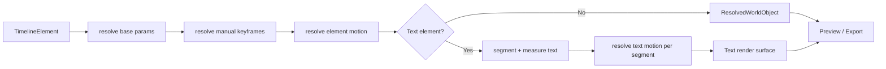

<!--
 * [INPUT]: 依赖 apps/editor 的 TimelineElement/ElementAnimations 数据模型、VisualRuntime.evaluate(localTime) 求值管线、
 *          animation 关键帧解析与 D1 提交策略、text/layout/measure-element 文本测量、组件注册表与 GSAP useTimeline 契约、
 *          catalog-first 素材目录与 timeline.command 统一写入口。
 * [OUTPUT]: 定义剪映式预设计动画（入场/出场/循环）与文本独立动画的产品分析、数据模型、运行时组合规则、目录/缓存、
 *           UI、operation、验证和分阶段实施方案；不直接改变现有代码。
 * [POS]: rfc 的动画产品与运行时架构蓝图；获批后作为 apps/editor animation/text-motion 实现、catalog 与 MCP/UI 行为的共同契约。
 * [PROTOCOL]: 变更时更新此头部，然后检查 README.md
 -->

# RFC: Editor 剪映式预设计动画与文本独立动画

- 状态：实施中（P0 runtime/catalog 已落地；UI 面板与远端目录仍按后续阶段接入；底层 runtime 以 [2026-08-22-editor-animation-runtime-architecture.md](./2026-08-22-editor-animation-runtime-architecture.md) 为准）
- 作者：Recut
- 日期：2026-08-22
- 范围：`apps/editor` 的视觉元素动画、文本动画、素材目录、编辑器面板、timeline operation 与预览/导出一致性
- 不在本 RFC 内：转场、全画布后处理特效、音频节拍检测、UGC 任意代码动画

## 1. 摘要

剪映的“动画”面板表面上是一组可下载的卡片，实质上更接近**绑定到时间线元素的 motion recipe**：

```text
动画目录素材
  -> 绑定到一个元素
  -> 按元素局部时间求值
  -> 与基础参数、手工关键帧、效果叠加
  -> 预览和导出使用同一份结果
```

文本不是普通图片的特例。它需要先把内容分成字、词、行或自定义片段，再以稳定的布局结果驱动每个片段的位移、透明度、缩放、旋转、模糊和遮罩。因此本 RFC 采用两层模型：

1. **通用动画处方（Motion Preset）**：适用于视频、图片、组件、图形和整块文本。
2. **文本动画处方（Text Motion Preset）**：复用同一时间和缓动模型，但额外声明分段器、错峰策略与文本渲染目标。

核心决策：动画预设不展开成不可逆的散乱关键帧，也不把预览 GIF 当成真实效果。预设是可版本化、可删除、可替换、可确定性求值的项目数据；现有 `ElementAnimations` 继续保存用户手工关键帧。

### P0 实现映射

- `apps/editor/ui/src/runtime/motion-presets.ts` 提供内置 catalog、参数校验、`enter/exit/loop` 编译与不可变绑定操作。
- `TimelineElement.motion` / `textMotion` 保存语义绑定；`buildWorld` 透传，`VisualRuntime.evaluate()` 在局部时间求值为 `MotionProgram`。
- P0 catalog 覆盖淡入淡出、四向滑入、缩放、旋入、弹跳、pulse/float/sway、shader progress，以及 grapheme/word 文本 reveal。
- `tests/e2e/ai-component.spec.ts` 使用带 `CanvasDrawElement` 的 Chromium 覆盖 Three 预设和 HTML-in-Canvas 文本预设；纯函数边界由 `motion-presets.test.ts` 覆盖。
- Shader 预设案例包括 `shader-reveal-burst`、`shader-intensity-pulse`、`shader-ripple-burst`、`shader-displacement-pop`；它们分别复用现有效果组件常见的 `uProgress`、`uIntensity`、`uStrength`、`uAmount` uniform。

### Shader 局部特效原则

Shader 预设不是替换整段 fragment shader，而是绑定到局部组件材质的 uniform 通道。预设定义可声明 `shaderUniforms` 兼容列表；运行时以 material 实际 uniforms 为最终真相，只编译存在的通道。这样同一个 Reveal Burst 可以作用于粒子、字符化、解密等已有组件，而不会把不支持该 uniform 的组件打成错误占位块。基础 uniform update 先执行，MotionProgram 随后 seek，确保预设覆盖局部动画而不被组件自身刷新逻辑抹掉。

## 2. 证据与边界：从剪映界面能推断什么

本节是黑盒产品分析，不声称掌握剪映内部源码。结论来自给定截图、常见非线性编辑器行为和可观察的交互约束。

### 2.1 视觉动画面板的可观察语义

截图一显示：

- 顶层分类为“画面 / 音频 / 变速 / 动画 / 调整 / AI 效果”。这说明动画是**元素属性编辑器**的一部分，而不是独立时间线轨道。
- 动画下再分“入场 / 出场 / 组合”。每个分类是一种**时间窗口语义**，不是三种完全不同的素材类型。
- 卡片有预览缩略图、名称、下载按钮和会员标识。说明目录项包含远端资源状态、权限和可缓存的预览数据。
- 首项“无”是一个真正的状态值，而不是删除操作。应用动画后仍能恢复到无动画。

截图二显示：

- 选中文本时，顶层分类变成“文本 / 动画 / 跟踪 / 朗读 / 数字人”。文本动画是文本编辑上下文内的独立能力。
- 文本动画分类为“入场 / 出场 / 循环”，多出循环而不是把“组合”原样复用。这暗示文本有独立的持续态动画。
- 预览缩略图使用 `ABC123` 等占位文本，说明目录项不是某个具体文字的 baked media，而是可以套到任意文本内容的参数化处方。
- “旋入、逐字旋转、随机集合、二段缩放”等名称暗示文本动画至少支持字/词级拆分和错峰。

### 2.2 推定的内部对象模型

剪映很可能把一个动画卡片拆成以下几类数据，而不是保存一段视频：

| 层 | 推定职责 | 对 Recut 的映射 |
|---|---|---|
| Catalog item | 名称、分类、封面、权限、版本、下载状态 | `catalog/animations.json` / CDN 目录 |
| Recipe | 参数化的时间段、目标属性、缓动、stagger、fill | `MotionPresetDefinition` |
| Binding | 预设绑定到哪个元素、哪个槽位、参数覆盖 | `element.motion` |
| Runtime instance | 当前局部时间的已求值状态 | `resolveMotionAtTime()` |
| Preview | 用代表性内容渲染的缩略图或短循环 | 本地确定性 preview renderer |

### 2.3 不应照搬的部分

- 不把每个动画做成独立视频资产。视频无法适配任意文字、时长和尺寸，也破坏可编辑性。
- 不把入场/出场/循环复制成三套关键帧代码。它们只是不同的时间映射。
- 不把文本逐字动画做成 N 个时间线文本片段。这样会污染轨道语义、破坏字幕导出并放大 undo 日志。
- 不让动画目录直接执行任意远端 JavaScript。预设目录必须是声明式数据；复杂动画走已验证的内置组件或受控 runtime recipe。

## 3. 现状与问题

当前 Editor 已经具备动画的底层能力：

- `TimelineElement.animations` 保存属性通道和关键帧。
- `VisualRuntime.evaluate(time)` 使用元素局部时间求值参数，Preview/Export 共用这条路径。
- D1 规定：已有关键帧时编辑落关键帧，没有关键帧时写基础参数。
- 文本由 `text/layout.ts`、`text/measure-element.ts` 和 Canvas 文本 primitive 渲染，布局测量与动画解析已有共享入口。
- 组件侧已有 `ComponentDefinition` 和 GSAP `useTimeline`，可表达复杂的 react/r3f 动效。

缺口在上层产品语义：

1. 用户需要“选择一个可预览的入场效果”，而不是手工添加四个 opacity/position keyframe。
2. 预设必须可以替换、移除、收藏、缓存和显示版本，否则目录卡片无法形成稳定产品。
3. 通用元素和文本需要不同的目标模型；整块文本的 transform 不能表达逐字错峰。
4. 手工关键帧和预设同时存在时，当前没有明确的组合优先级。

## 4. 目标与非目标

### 4.1 目标

- 为所有视觉元素提供 `入场 / 出场 / 循环` 预设槽位。
- 文本提供 `整块 / 行 / 词 / 字素` 分段动画，Unicode 安全且布局稳定。
- 预设只保存语义绑定和参数，不破坏用户关键帧；可在 Inspector 中替换、清除和调节时长。
- UI、MCP 和未来 AI 使用同一个 Model API 与 timeline op。
- 预览、封面、导出在相同项目版本和时间点上得到相同结果。
- 目录支持本地内置、CDN 远端、下载状态、权限标识和离线回退。

### 4.2 非目标

- 本期不做任意用户上传的动画脚本执行。
- 本期不做跨多个元素的“组合动画”资产。多元素编排应先落为组件或未来的 group motion RFC。
- 本期不把现有手工关键帧迁移成预设。
- 本期不改变转场、音频自动化或全画布后处理的既有模型。

## 5. 核心设计

### 5.1 时间模型：一切动画都以元素局部时间为基准

令元素时间范围为 `[0, duration]`，预设只接受局部时间 `t`：

```text
globalTime -> elementLocalTime -> presetTimeMap -> recipe channels -> resolved node state
```

三种槽位的时间映射：

```ts
type MotionSlot = "enter" | "exit" | "loop";

interface MotionTimeMap {
  slot: MotionSlot;
  durationSec?: number;      // enter/exit 的有效窗口；缺省由 recipe 给出
  mode: "clamp" | "loop";
  easing?: string;           // 仅允许确定性 ease 白名单
}
```

- `enter`：`t = clamp(localTime / enterDuration, 0, 1)`，结束后保持最终状态。
- `exit`：从出场窗口开始计算，`t = clamp((localTime - (duration - exitDuration)) / exitDuration, 0, 1)`，结束后保持出场终态。
- `loop`：只在元素存在期间循环，`t = mod(localTime - delay, loopDuration)`。
- clip 被 trim、split 或 retime 时，绑定仍随元素存在；运行时重新按当前元素 `duration` 求值。

### 5.2 动画层：预设与手工关键帧分离

不把预设“烘焙”进 `animations`。元素增加可选的 motion 绑定：

```ts
interface ElementMotion {
  version: 1;
  enter?: MotionBinding | null;
  exit?: MotionBinding | null;
  loop?: MotionBinding | null;
}

interface MotionBinding {
  presetId: string;
  presetVersion: string;
  params?: Record<string, string | number | boolean>;
  enabled?: boolean;
  durationSec?: number;
  mode?: "clamp" | "loop";
}
```

`TimelineElement` 增加 `motion?: ElementMotion`；文本再增加 `textMotion?: TextMotionBinding`，二者都属于项目文档数据。

求值顺序固定为：

```text
base params
  -> manual keyframe channels（现有 ElementAnimations）
  -> motion preset layer（delta/multiplier 组合）
  -> text segment layer（仅 text）
  -> ephemeral preview overlay
  -> renderer
```

预设不能无条件覆盖用户属性，recipe 的每条通道必须声明组合方式：

```ts
type MotionBlend = "replace" | "add" | "multiply" | "min" | "max";

interface MotionChannel {
  path: string;                 // transform.positionX / opacity / text.segment.opacity ...
  blend: MotionBlend;
  keys: MotionKey[];
}

interface MotionKey {
  at: number;                    // 0..1，recipe 局部进度
  value: number | string | boolean;
  segmentToNext?: "hold" | "linear" | "bezier";
}
```

默认规则：

- 位置、旋转使用 `add`，预设表达相对偏移，不破坏用户摆放。
- scale 使用 `multiply`，预设表达相对缩放。
- opacity 使用 `multiply`，确保用户设置的整体透明度仍然有效。
- 非连续状态（如 blur enabled）使用 `replace`，且只允许一个 owner。
- 用户明确编辑同一属性的手工关键帧后，Inspector 显示冲突提示；不会静默删除预设。

这使“动画 + 用户位置关键帧”成为正常组合，而不是特殊分支。

### 5.3 预设定义：声明式优先，组件兜底

目录项的稳定格式：

```ts
interface MotionPresetDefinition {
  id: string;
  version: string;
  nameKey: string;
  category: "element" | "text";
  slots: MotionSlot[];
  targets: Array<"video" | "image" | "text" | "graphic" | "component">;
  preview: { assetUrl?: string; sample: "generic" | "text" | "media" };
  access: { tier: "free" | "pro"; requiresDownload?: boolean };
  parameters: ParamDefinition[];
  implementation:
    | { kind: "declarative"; channels: MotionChannel[] }
    | { kind: "builtin-component"; componentId: string };
}
```

选择原则：

1. 常见的淡入、滑入、缩放、旋转、模糊、弹性等使用 `declarative`，易校验、易缓存、可在任意渲染器复现。
2. 需要路径、复杂遮罩、粒子或多材质的效果使用已验证的 `builtin-component`，仍必须接受 `localTime` 并通过现有确定性组件契约渲染。
3. 远端目录只能提供数据和签名资源，不能携带可执行 JS。

### 5.4 文本动画：分段器 + selector + stagger

文本预设额外描述“对什么单位动画”：

```ts
type TextSegmentMode = "whole" | "line" | "word" | "grapheme";

interface TextMotionBinding extends MotionBinding {
  segment: {
    mode: TextSegmentMode;
    order: "forward" | "reverse" | "random-seeded";
    seed?: string;
    staggerSec: number;
    maxSegments?: number;
  };
  layout: "preserve" | "reflow";
}
```

渲染步骤：

```text
content + typography
  -> segmentText（Intl.Segmenter；无运行时支持时使用固定 fallback）
  -> measureTextSegments（记录每段 x/y/line/width/height）
  -> resolve recipe for segment i at t - i * stagger
  -> draw segment into the existing text surface
```

规则：

- 默认 `grapheme`，中文、emoji、组合音标不被错误拆开；英文可由目录项选择 `word`。
- `layout: preserve` 保持最终排版盒不变，只改变每段的绘制状态，避免动画期间文本抖动和选择框跳动。
- `layout: reflow` 只允许明确声明的“逐字排版”预设使用，且必须在 catalog 中标注动态边界。
- “随机”只能是由 `presetId + elementId + seed` 派生的稳定排列，禁止 `Math.random()`。
- 字幕轨默认只允许 `whole` 或 `word`，避免每个字素破坏字幕阅读和导出语义；普通文本允许全部模式。

文本动画的视觉目标不是新建多个元素，而是在一个 `TextElement` 内产生 segment layer。字幕导出、选区、undo 和项目文件仍只看到一个文本元素。

## 6. 运行时架构



新增纯函数边界：

```ts
function resolveMotionAtTime(args: {
  element: TimelineElement;
  localTime: number;
  presetRegistry: MotionPresetRegistry;
}): MotionResolvedLayer;

function resolveTextMotionAtTime(args: {
  element: TextElement;
  localTime: number;
  textLayout: MeasuredTextElement;
  presetRegistry: MotionPresetRegistry;
}): TextSegmentResolvedLayer | null;
```

`VisualRuntime.evaluate()` 只增加这两个求值步骤，不改变当前世界对象图和 `Preview==Export` 的时序。组件动画仍走 `useTimeline`，但由 `builtin-component` recipe 通过实例参数绑定到元素局部时间。

### 6.1 渲染与 bounds

- 普通元素 bounds 继续来自真实渲染几何。
- `preserve` 文本动画的选择框使用最终布局 bounds，而不是某一帧 alpha bounds；用户拖动时不会因字素暂时透明而失去命中区。
- 需要视觉裁切的 text preset 在定义中声明 `clipPolicy`，渲染器据此创建稳定的 segment clip，而不由每帧 DOM 结构猜测。

### 6.2 性能

- catalog 定义按 `presetId@version` memoize；绑定只保存 ID 和小参数。
- 文本分段与测量按 `content + typography + canvasSize` 缓存，时间变化只求值 segment channel。
- 预设不生成大量关键帧对象；一个 100 字文本仍是一个时间线元素。
- 预览可降低纹理捕获质量，但不能改变时间语义或动画结果。

## 7. 目录、下载与缓存

沿用已有 catalog-first 三级回退：

```text
CDN catalog -> apps/editor/catalog/animations.json -> builtin fallback
```

目录必须包含：

```json
{
  "id": "text.fade-up",
  "version": "1.0.0",
  "category": "text",
  "slots": ["enter"],
  "nameKey": "animation.text.fadeUp",
  "access": { "tier": "free" },
  "implementation": { "kind": "declarative", "channels": [] },
  "preview": { "sample": "text" }
}
```

下载状态是 UI 状态，不写入项目文档：`available / downloading / ready / failed / offline`。项目只保存 `presetId + presetVersion`，打开项目时按版本解析；版本不可用时显示“动画资源缺失”，保留绑定，不静默换成相似效果。

预览封面由固定样例渲染：

- 普通动画：标准渐变底图 + 几何形状 + 标题。
- 文本动画：`ABC123` + 当前目录项声明的字号/行数。
- 生成过程固定 `fps / canvasSize / duration / seed`，封面不依赖墙钟。

## 8. 编辑器 UI

### 8.1 普通元素

Properties 面板新增 `Animation` 区域：

```text
Animation
  [Enter] [Exit] [Loop]
  [Favorites] [All] [Search]
  preset grid
  duration / easing / intensity (preset-defined params)
  Replace | Remove
```

行为：

- 卡片 hover 播放短预览；点击应用；下载图标只触发缓存，不改变时间线。
- “无”是每个槽位的第一项，点击立即清除该槽位绑定并生成一个 undoable op。
- 当前绑定卡片显示选中态、版本和缺失状态。
- 有手工关键帧时保留现有关键帧编辑器；动画区显示“预设与关键帧叠加”的可见提示，不把两者折叠成一张不可解释的卡片。

### 8.2 文本元素

文本选中时保留“文本 / 动画 / 跟踪 / 朗读 / 数字人”顶层结构；动画面板的槽位为 `入场 / 出场 / 循环`。

在卡片区上方增加低密度的文本目标选择：

```text
Apply to: [Whole] [Line] [Word] [Character]
Stagger:   [slider]
Layout:    [Preserve] [Reflow]
```

这些是绑定参数，不是目录分类。目录项只声明支持的 segment mode，UI 根据 capability 禁用不支持的选项。

### 8.3 时间线表达

时间线上不新增动画轨道；元素片段显示小型 `motion` badge，展开元素时可显示 Enter/Exit/Loop 标记。这样保留剪映式“动画属于元素”的心智，又不破坏现有轨道结构。

## 9. Model API 与 timeline op

UI 和 MCP 都调用同一组模型方法：

```ts
interface AnimationModelApi {
  applyPreset(ref: ElementRef, slot: MotionSlot, binding: MotionBinding): void;
  removePreset(ref: ElementRef, slot: MotionSlot): void;
  setTextMotion(ref: ElementRef, binding: TextMotionBinding | null): void;
  setPresetParam(ref: ElementRef, slot: MotionSlot, key: string, value: ParamValue): void;
}
```

写入统一进入 `timeline.command`，建议新增 op：

| op | 作用 |
|---|---|
| `motion-preset-apply` | 给元素某个 slot 绑定 preset，校验目标类型和版本 |
| `motion-preset-remove` | 清除 slot，保留其它 slot 与手工关键帧 |
| `motion-preset-param` | 修改绑定参数，不改 catalog 定义 |
| `text-motion-set` | 设置文本分段器、错峰、布局策略和 preset |

所有 op 具备版本号、undo 快照、`baseVersion` 冲突检测和 `timeline.validate` 校验；AI 不直接写 `element.motion` JSON。

MCP 只读摘要扩展：

```text
timeline.read.clips[].motion = {
  enter: { presetId, presetVersion, durationSec },
  exit:  ...,
  loop:  ...
}
```

`element.get` 返回完整 binding、参数和文本分段配置；目录读取沿用 `library.browse` 的 catalog-first 入口。

## 10. 校验与错误处理

`timeline.validate` 增加：

- `preset-id`：ID 和版本必须存在或被明确标记为缺失。
- `preset-target`：text preset 不能绑定到 video，component-only preset 不能绑定到 text。
- `preset-slot`：recipe 声明支持的 slot 才能绑定。
- `preset-param`：参数类型、范围和枚举值符合定义。
- `text-segment`：字幕轨禁止不安全的 grapheme/reflow 组合；`stagger >= 0`。
- `motion-determinism`：拒绝墙钟、未种子随机、未暂停的 GSAP 驱动和远端可执行脚本。
- `motion-duration`：enter/exit 窗口不能超过元素时长；loop 时长必须大于 0。

资源缺失不是静默降级：

```text
ready       -> 正常渲染
missing     -> 保留 binding，渲染基础状态，显示可修复错误
invalid     -> validation fail，不允许导出
```

## 11. 迁移与兼容

### 11.1 现有项目

- `motion` 缺省表示无预设，所有旧项目无需迁移。
- 现有 `ElementAnimations` 原样保留。
- 不自动把已有关键帧猜测成某个 preset，避免不可逆的错误归因。

### 11.2 现有组件

- `component` 元素可绑定通用 motion preset。
- 复杂组件继续使用 `ComponentDefinition` + `useTimeline`；preset 只传入 `localTime`、参数和 slot 语义。
- `html` surface 继续使用 `anim.*`；需要 GSAP 的 preset 选择 `react/r3f` builtin component。

## 12. 实施计划

| 阶段 | 内容 | 验收 |
|---|---|---|
| P0 | 增加 `MotionPresetDefinition`、`ElementMotion` 类型和内置 3 个 declarative preset（fade/slide/scale）；接入 `VisualRuntime.evaluate` | 普通元素入场/出场与手工 transform 组合正确，Preview==Export |
| P1 | catalog、缓存状态、`library.browse` 动画分类、Properties 动画面板、4 个 motion op | 应用/替换/删除/撤销、离线缺失可发现 |
| P2 | 文本 segment 测量与 `whole/line/word/grapheme`；文本动画面板和字幕限制 | 中文、emoji、多行文本布局稳定，字幕导出不变 |
| P3 | builtin-component recipe、GSAP `useTimeline` 绑定、封面渲染和 deterministic harness | 复杂 text preset 与普通组件在 UI/导出一致 |
| P4 | AI/MCP 摘要、批量绑定、收藏/最近使用、性能优化 | `timeline.read`/`element.get` 可审计，100 字文本不产生 N 个元素 |

## 13. 验收与测试

### 13.1 单元测试

- `resolveMotionAtTime`：enter/exit/loop 的边界、hold、trim、retime。
- blend：add/multiply/replace 的数值结果和手工关键帧组合。
- text segmentation：中文、英文、emoji、组合音标、多行、空字符串。
- seeded order：同一 `(presetId, elementId, seed)` 始终得到同一顺序。
- catalog schema、参数范围、版本缺失和目标类型校验。

### 13.2 浏览器测试

| spec | 断言 |
|---|---|
| `motion-preset-apply.spec` | 点击卡片后 binding 写入，预览在 t=0/中间/末尾符合预期 |
| `motion-preset-undo.spec` | replace/remove/undo 不影响其它 slot 和手工关键帧 |
| `text-motion-layout.spec` | whole/line/word/grapheme 切换不产生额外 timeline 元素，选择框稳定 |
| `preview-export-motion.spec` | 同项目、同时间点的预览帧与导出帧参数/像素一致 |
| `motion-missing-asset.spec` | 缺失版本可见、可恢复，不静默替换 |

### 13.3 质量门

- `timeline.validate` 无 motion 违规。
- 组件构建期确定性扫描通过。
- 文本动画不引入 `requestAnimationFrame`、`Date.now` 或 `Math.random`。
- 预设应用不创建额外文本元素，不破坏字幕 `source/cueIndex`。
- `npm run build`、service 测试与 Editor 现有 Playwright 回归保持通过。

## 14. 关键取舍

### 14.1 为什么不直接把预设展开为关键帧

展开后看似简单，实际上失去三个能力：版本可追踪、参数可调整、与用户手工关键帧组合。预设是“意图”，关键帧是“手工曲线”；把意图抹平成曲线，编辑器就无法解释用户在做什么。

### 14.2 为什么文本动画不拆成多个时间线元素

逐字拆片会让轨道、字幕导出、选区、撤销和 AI 读取都变复杂。文本分段是渲染层内部结构，时间线仍然保持一个文本元素，边界自然统一。

### 14.3 为什么目录优先使用声明式 recipe

动画目录是产品资产，不应成为远端代码执行入口。声明式 recipe 能被 schema 校验、缓存、版本化、预览和导出；只有确实需要复杂几何时才进入已验证的内置组件路径。

## 15. 开放决策

以下事项在 P1 前确认，不阻塞本 RFC 的数据模型：

1. 会员动画的权限由 Recut catalog 统一控制，还是允许 App 自己声明商业 tier。
2. 第一批内置 text preset 是否只提供 `preserve`，以及 `reflow` 的可接受边界。
3. 复杂 preset 的 `builtin-component` 是否需要独立的 animation asset 类型，还是复用现有 component asset。
4. 预设参数是否允许写入项目级 style token，还是只允许实例级覆盖。

## 16. 参考现有实现

- `apps/editor/ui/src/timeline/types.ts`：元素与 `animations` 数据结构。
- `apps/editor/ui/src/animation/`：关键帧通道、插值和求值。
- `apps/editor/ui/src/runtime/world-runtime.ts`：局部时间驱动的 `VisualRuntime.evaluate()`。
- `apps/editor/ui/src/text/layout.ts`、`measure-element.ts`：文本测量与可视边界。
- `apps/editor/skills/recut-editor/references/keyframes.md`：D1 关键帧提交策略。
- `rfc/2026-08-13-visual-runtime-component-system.md`：世界对象与 Preview/Export 共用 runtime。
- `rfc/2026-08-20-editor-component-gsap-animation.md`：组件侧 GSAP Timeline + seek(t) 确定性契约。
