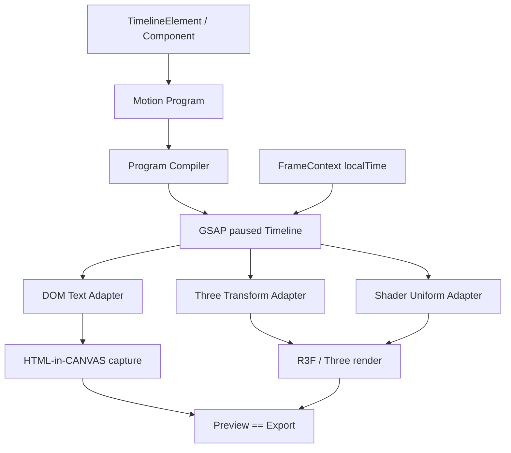

<!--
 * [INPUT]: 依赖 apps/editor 的 HTML-in-CANVAS 文本 surface、React 组件承载面、Three/R3F WorldScene、
 *          VisualRuntime.evaluate(localTime)、ElementAnimations 关键帧、shader material/统一材质注册表、
 *          GSAP useTimeline/useFrameContext 确定性契约与 Preview==Export 渲染时序。
 * [OUTPUT]: 定义 Editor 动画的本质层架构：统一 seekable timeline、DOM/Three/Shader 三类目标适配器、文本组件升级、
 *           Motion Program 序列化模型、预设编译与运行时边界、验证和实施路线。
 * [POS]: rfc 的动画 runtime 总设计；优先于 2026-08-22-editor-animation-presets.md 约束底层执行模型，
 *        并作为 animation/text/runtime/shader 实现与后续产品预设的共同契约。
 * [PROTOCOL]: 变更时更新此头部，然后检查 README.md
 -->

# RFC: Editor Animation Runtime——GSAP Timeline 与三类渲染目标适配器

- 状态：提议
- 日期：2026-08-22
- 层级：本质层 runtime；产品层预设见 [Editor 剪映式预设计动画与文本独立动画](./2026-08-22-editor-animation-presets.md)
- 目标：让文本、Three Transform、Shader Material 共享同一动画语义、时间轴和验证闭环

## 1. 核心判断

动画的本质不是“给元素贴一张动画卡片”，而是：

> 在稳定的渲染对象图上，用局部时间 `t` 求出一组可见属性的状态。

形式化表示：

```text
MotionProgram + RenderTargetRegistry + localTime
  -> seekable GSAP Timeline
  -> target adapters mutate visible state
  -> Preview / Export frame
```

因此需要区分三个概念：

| 概念 | 负责什么 | 是否持久化 |
|---|---|---|
| Animation Runtime | 在某个 `t` 把动画程序求值到真实渲染对象 | 否，运行时实例 |
| Motion Program | 描述目标、属性、时序、缓动和组合方式 | 是，项目/目录数据 |
| Motion Preset | 一份可复用的 Motion Program 模板及元数据 | 是，catalog 资产 |

GSAP 是统一的**执行引擎**，不是项目文件格式，也不是目标对象模型。它统一 timeline、ease、stagger、label、seek；DOM、Three、Shader 仍通过各自 adapter 解释属性路径和生命周期。

## 2. 三类本质能力

### 2.1 HTML-in-CANVAS 文本：DOM/React 节点动画

当前文本最终被捕获为 HTML-in-CANVAS 内容。文本动画最自然的实现不是把文字变成图片序列，而是：

```text
TextElement
  -> stable React text surface
  -> segment spans（whole / line / word / grapheme）
  -> measure once
  -> GSAP timeline targets spans
  -> CanvasDrawElement capture
```

这意味着文本组件必须升级为**可动画文本 surface**：

- 文本 DOM 树在一个元素生命周期内保持稳定；时间变化只 seek，不重建 span 树。
- 每个 segment 有稳定 `data-segment-id` 和 React ref；GSAP 只修改 transform、opacity、filter、clip-path、CSS variables 等合成属性。
- 最终布局盒与动画姿态分离。默认 `layout: preserve`，span 仍占据最终排版空间，避免字素进出导致整段文本 reflow。
- 字体、换行、字距和 Canvas 尺寸变化才触发重新分段/测量/建 timeline。
- 捕获顺序固定为：`timeline.seek(t) -> React layout flush -> CanvasDrawElement capture -> Three draw`。

GSAP 的 `SplitText` 思路可以复用，但不能直接把第三方插件当作持久化数据。Recut 自己拥有 `segmentText()`、Unicode 安全的 grapheme/word/line 结果和 segment registry；GSAP 只消费这些稳定目标。

### 2.2 Three Transform：Object3D 的可见几何状态

Three/R3F 中，Transform 动画直接作用于稳定的 `Object3D`：

```text
Object3D.position / rotation / scale / quaternion / userData
  <- GSAP tween / seek
  -> R3F demand render
```

约束：

- `Object3D` identity 稳定，不能因时间变化卸载或换 key。
- 被 GSAP 驱动的 `position`、`rotation`、`scale` 不得同时由时变 JSX props 写入；否则 R3F reconcile 会覆盖 seek 结果。
- 2D 编辑器使用 `positionX/Y`、`scaleX/Y`、`rotate` 的语义映射；3D 组件可使用 `position.z`、`rotation.x/y/z`、camera target 等真实 Three 属性。
- 旋转默认使用 Euler；四元数需要显式 proxy adapter，不能让每个组件自行解决插值。
- Transform 只表达几何运动；材质视觉变化进入 Shader adapter，不把 shader uniform 伪装成 transform 参数。

### 2.3 Shader Material：Uniform 驱动的视觉状态

Shader 动画的本质是固定 shader 程序 + 随时间变化的 uniform：

```text
ShaderMaterial.uniforms
  -> uProgress / uTime / uReveal / uDistortion / uNoiseSeed / uColor...
  <- GSAP timeline seek
  -> GPU fragment/vertex evaluation
```

约束：

- shader source、attribute、geometry 在实例生命周期内稳定；动画只改变 uniform value。
- `uTime` 不读取 `Date.now()`、`performance.now()` 或 shader 内部墙钟；由 `FrameContext.localTime` 或 timeline 明确写入。
- uniform 目标使用 `{ value: ... }` proxy，GSAP 写入 `uniform.value`；R3F JSX 不得在同一帧重新创建 uniforms 对象。
- 颜色、向量、矩阵和纹理切换分别定义 adapter；不能让 recipe 假设所有 uniform 都是 scalar。
- 需要纹理/后处理的效果仍可使用现有 effect/component registry，但其时间入口必须收敛到同一 seek 时序。

## 3. GSAP 能复用什么，不能复用什么

### 3.1 统一复用面

三类目标都可以复用：

- `gsap.timeline({ paused: true })` 的时间轴结构。
- `seek(time)` / `progress(value)` 的确定性驱动。
- ease、keyframes、labels、position parameter、stagger。
- timeline 生命周期：build、register、seek、kill、rebuild。
- 同一套 deterministic scan：禁止墙钟、自动播放、无限循环、未种子随机。
- 同一套 proof：首帧、关键中间姿态、最终姿态、Preview==Export。

### 3.2 必须保持差异的部分

不能把三者强行抽象成“一个字符串属性路径”：

| 目标 | 属性语义 | 生命周期 | 典型风险 |
|---|---|---|---|
| DOM/React text | CSS transform、opacity、filter、clip、CSS var | React mount + Canvas capture | span 重建、布局 reflow、捕获读到上一帧 |
| Three Transform | Vector3/Euler/Object3D 属性 | R3F mount + invalidate | JSX reconcile 覆盖、对象 identity 丢失 |
| Shader Uniform | `uniform.value`、Color、Vector、Matrix、纹理 | material mount/dispose | uniform 对象替换、GPU 状态泄漏、墙钟 uTime |

统一的是**时间与调度**，差异留在**目标适配器**。这是消除特殊分支的最小抽象。

## 4. Runtime 架构



### 4.1 FrameContext

```ts
interface FrameContext {
  time: number;       // 全局秒
  localTime: number;  // 元素/组件局部秒
  progress: number;   // localTime / duration
  frame: number;
  fps: number;
  mode: "preview" | "export" | "thumbnail";
}
```

Runtime 每次 frame 做一次：

```text
1. resolve base params + existing ElementAnimations
2. build/reuse MotionRuntime instance
3. runtime.seek(localTime)
4. flush HTML/React text surface
5. invalidate/draw Three scene
6. capture/export the settled frame
```

禁止各目标自己推进时间。`useFrameContext()` 只读时间；它不是一个允许 `requestAnimationFrame` 的逃生口。

### 4.2 Target Adapter

```ts
type MotionTargetKind = "dom" | "three" | "shader";

interface MotionTargetAdapter {
  kind: MotionTargetKind;
  resolveTarget(ref: string): object | null;
  normalizePath(path: string): string;
  applyInitialState(target: object, path: string, value: unknown): void;
  canAnimate(path: string, value: unknown): boolean;
  dispose?(): void;
}
```

adapter 只负责“目标如何被找到、路径如何落到真实对象、初始状态如何安全设置”。它不拥有时间、不创建 timeline、不决定预设产品分类。

### 4.3 Timeline Registry

每个渲染实例拥有独立 timeline：

```ts
interface MotionRuntime {
  id: string;
  timeline: gsap.core.Timeline;
  adapters: MotionTargetAdapter[];
  seek(frame: FrameContext): void;
  rebuild(program: MotionProgram): void;
  dispose(): void;
}
```

`useTimeline` 是组件作者 API；`compileMotionProgram` 是数据驱动预设 API。两者最终都注册为 `MotionRuntime`，从而共享 seek、验证和导出。

## 5. Motion Program：引擎中立的持久化格式

GSAP 不是项目文件格式。项目中保存可验证的 Motion Program，运行时再编译为 GSAP timeline：

```ts
interface MotionProgram {
  schemaVersion: 1;
  durationSec: number;
  mode: "once" | "loop";
  tracks: MotionTrack[];
}

interface MotionTrack {
  target: {
    kind: MotionTargetKind;
    ref: string;               // text:seg-3 / object:root / material:main
  };
  path: string;                // opacity / x / position.y / uniforms.uProgress
  blend: "replace" | "add" | "multiply";
  keys: Array<{
    at: number;                // 0..durationSec
    value: number | string | boolean | number[];
    ease?: string;
  }>;
}
```

编译器职责：

1. 校验 target kind 与 path capability。
2. 将相对值、绝对值和 blend 语义编译成 GSAP tween。
3. 将 `stagger`、segment selector、enter/exit/loop 时间映射展开为 track offsets。
4. 保证 timeline paused，并注册到实例级 registry。

这使 catalog 能保存声明式动画，也允许复杂组件用代码创建同一运行时实例。

## 6. 文本组件升级设计

### 6.1 稳定的 TextSurface

```tsx
<TextSurface ref={surfaceRef}>
  <span data-segment-id="g-0" ref={segmentRefs[0]}>你</span>
  <span data-segment-id="g-1" ref={segmentRefs[1]}>好</span>
</TextSurface>
```

实际实现不要求用户看到 span；它是 HTML-in-CANVAS 的内部渲染树。对外仍然是一个 `TextElement`。

TextSurface 提供：

- `segmentText(content, mode)`：Intl.Segmenter 优先，固定 fallback 兜底。
- `measureSegments(typography, canvasSize)`：一次测量，记录 line、x、y、width、height。
- `registerSegmentTargets()`：返回稳定 refs 给 Motion Program compiler。
- `getStableBounds()`：最终布局盒用于选择、命中和导出。
- `captureSettledFrame()`：在 timeline seek 后触发 HTML-in-CANVAS 捕获。

### 6.2 文本动画的两条路径

| 路径 | 适用 | 实现 |
|---|---|---|
| `whole` | 整段标题、字幕整体入场 | root DOM target，GSAP transform/opacity |
| `line/word/grapheme` | kinetic typography、逐字/逐词 | segment refs + stagger + per-segment targets |

默认使用 `layout: preserve`。只有明确声明的 reflow preset 才允许修改排版流；reflow 必须重新计算 bounds，并在 UI 标记“动态布局”。

### 6.3 文本与 GSAP SplitText 的边界

- 可以复用 SplitText 的“拆分思路”和 GSAP 的 stagger 能力。
- 不把 SplitText 生成的临时 DOM 当项目数据；项目只保存 segment mode、order、stagger 和 Motion Program。
- Unicode segmentation、字幕限制、字体测量和稳定 bounds 由 Recut TextSurface 所有。
- `ScrambleText` 等插件只能作为已审核的 target adapter/plugin，不得直接读取墙钟或随机源。

## 7. Three Transform 与 Shader 的组合

同一元素可以同时拥有多个 track：

```text
object:root / position.y       -> Three Transform Adapter
object:root / rotation.z       -> Three Transform Adapter
material:main / uniforms.uReveal -> Shader Adapter
```

组合规则：

- Transform 负责主体的空间运动；shader 负责表面显隐、扭曲、溶解、噪声和颜色。
- 两者共享同一 timeline，使用 labels 对齐“进入、峰值、落定”等语义状态。
- 不允许两个 track 无声明地写同一个目标路径；编译器必须报告冲突或显式使用 blend。
- shader 的 `uTime` 若只是随片段时间推进，应由 Motion Program 写入；不能在 GLSL 中自行累加时间。

## 8. 与现有 ElementAnimations 的关系

现有 `ElementAnimations` 是用户直接编辑的基础参数关键帧；Motion Program 是预设/组件的高级动画层。求值顺序固定：

```text
base params
  -> ElementAnimations（D1）
  -> Motion Program（GSAP seek）
  -> text segment layer / shader uniforms
  -> ephemeral drag/AI preview overlay
  -> renderer
```

同一路径冲突时：

- 用户关键帧拥有基础值真相；preset 默认使用相对 `add/multiply`，不抹掉用户曲线。
- `replace` 必须在 program 中声明 owner；多个 owner 直接 validation fail。
- 用户关闭 preset 只移除 Motion Program binding，不删除 ElementAnimations。

## 9. 预设编译与剪映式产品层

剪映式“入场 / 出场 / 组合（或循环）”只是 program 的时间槽位：

```text
Preset Catalog Item
  -> slot binding (enter/exit/loop)
  -> parameter substitution
  -> Motion Program
  -> GSAP timeline + adapters
```

预设目录不携带可执行远端 JS。普通淡入、滑入、缩放、逐字、shader dissolve 使用 declarative program；复杂粒子/路径/材质效果使用已验证的 builtin component，但仍必须注册到同一个 MotionRuntime。

上一份预设 RFC 中的 UI、catalog、下载、权限、timeline op 继续有效；本 RFC 只把其“实现”改为 Motion Program 编译到统一 runtime，而不是直接把 preset 解释成一套独立关键帧系统。

## 9.1 预设动画目录规划

预设目录不应从“效果名字”开始，而应从**可复用的视觉机制**开始。每个 preset 必须标注：

```ts
interface MotionPresetCapability {
  id: string;
  target: "dom-text" | "three-transform" | "shader" | "composite";
  slots: Array<"enter" | "exit" | "loop" | "combo">;
  channels: string[];
  complexity: "atomic" | "composed";
  cost: "low" | "medium" | "high";
  readableAt: number[];       // 推荐 proof 时间点
}
```

### 9.1.1 第一层：原子预设

原子预设只改一类清晰的可见属性，便于组合、调参和验证。

| 预设族 | 具体预设 | 目标 | 底层机制 |
|---|---|---|---|
| 透明度 | Fade In / Fade Out / Pulse | DOM、Three、Shader | `opacity` 或材质透明度 |
| 位移 | Slide Left/Right/Up/Down | DOM、Three | `x/y` 或 `position.x/y` |
| 缩放 | Scale In / Scale Out / Pop | DOM、Three | `scale`，可配 back/elastic ease |
| 旋转 | Rotate In / Rotate Out / Card Flip | DOM、Three | `rotation` / `rotation.z`，3D 可扩展 x/y |
| 模糊 | Blur In / Blur Out / Focus Pulse | DOM、Shader | CSS filter 或 shader blur uniform |
| 裁切 | Wipe Left/Right/Up/Down | DOM、Shader | clip-path、mask 或 `uProgress` |
| 光效 | Shine Sweep / Glow Pulse | DOM、Shader | CSS variable 或 glow uniform |
| 噪声 | Jitter / Flicker / Grain Pulse | Shader、Three | seeded noise 参数或材质 uniform |

原子预设的目标是形成稳定的“动词库”，例如 `slide + fade`，而不是直接为每一种组合创建一份新实现。

### 9.1.2 第二层：组合预设

组合预设由原子预设通过 timeline label、position parameter 和 stagger 编排产生：

| 组合预设 | 阶段 | 适用对象 |
|---|---|---|
| Soft Enter | fade + slide + settle | 图片、组件、整段文本 |
| Spring Pop | scale + overshoot + settle | 图形、标题、贴纸 |
| Focus Reveal | blur + opacity + scale | 视频、图片、标题 |
| Masked Reveal | clip/wipe + fade | 标题、卡片、shader overlay |
| Glitch Reveal | scramble/displace + opacity + settle | 标题、数字、技术风格组件 |
| Exit Dissolve | opacity + blur/disintegrate | 图片、组件、文本 |
| Card Flip | rotateY + depth + opacity | Three 卡片、3D 组件 |

组合预设必须保留每个阶段的语义，不能编译成一条不可解释的黑盒 tween；这样 UI 才能暴露总时长、强度、方向和落定时间等参数。

### 9.1.3 第三层：文本专用预设

文本预设的差异不在“另一个 GSAP”，而在**segment target + stagger + 文本特有的可读性约束**：

| 文本预设族 | 具体预设 | segment | 实现机制 |
|---|---|---|---|
| 出现 | Typewriter / Fade Characters | grapheme / word | opacity、clip、逐段 offset |
| 上浮 | Rise Characters / Rise Words | grapheme / word | `y` + opacity + stagger |
| 弹跳 | Character Pop / Bounce Baseline | grapheme | scale、y、back/elastic |
| 旋转 | Letter Spin / Flip In | grapheme | rotation、transform-origin、perspective |
| 聚散 | Scatter In / Assemble | grapheme / word | seeded x/y/rotation → settle |
| 波动 | Wave / Baseline Wave | grapheme | 正弦式相位，但由 timeline keyframes 固化 |
| 聚焦 | Blur to Sharp / Glow Type | whole / word | filter 或 shader-backed text surface |
| 逐字替换 | Scramble / Decode | grapheme / word | 确定性字符表和离散 hold channel |
| 强调 | Highlight Sweep / Marker Draw | word / line | clip-path、CSS var、mask |

文本目录项必须声明 `segmentMode`、`layoutPolicy`、`maxSegments` 和 `readabilityHold`。字幕轨默认只开放 `whole`、`word` 和低强度 `rise/fade`，普通文本才开放 scatter、spin、scramble 等高扰动效果。

### 9.1.4 第四层：Shader 专用预设

Shader 预设要围绕“可见材质机制”命名，而不是把 shader 文件名暴露给用户：

| Shader 预设族 | 具体预设 | 主要 uniforms |
|---|---|---|
| 溶解 | Noise Dissolve / Burn Reveal | `uProgress`, `uNoiseScale`, `uEdgeWidth` |
| 扭曲 | Liquid Warp / Wave Distort | `uProgress`, `uAmplitude`, `uFrequency` |
| 扫描 | Scanline Reveal / Radar Sweep | `uProgress`, `uAngle`, `uSoftness` |
| 色彩 | Chromatic Split / Color Flash | `uAmount`, `uColorA/B`, `uProgress` |
| 像素 | Pixelate In / Digital Break | `uPixelSize`, `uProgress` |
| 光照 | Rim Glow / Energy Pulse | `uIntensity`, `uRadius`, `uColor` |
| 故障 | RGB Jitter / Block Glitch | seeded offsets、`uBlockSize` |

第一版只允许已经登记的 shader material 定义；preset 不能动态上传 GLSL。每个 shader preset 都要提供低成本 preview fallback，资源或 GPU 能力不足时仍能显示基础状态和缺失提示。

### 9.1.5 循环预设规划

循环预设不是“把入场动画重复播放”，而是独立的持续态动作：

| 循环族 | 具体预设 | 适用对象 |
|---|---|---|
| 呼吸 | Breathe / Glow Breathe | 标题、图标、组件 |
| 漂浮 | Float / Drift / Parallax Float | 图片、组件、3D 对象 |
| 脉冲 | Pulse / Ring Pulse | 图形、shader |
| 闪烁 | Blink / Flicker / Signal | 文本、数字、shader |
| 波动 | Wave / Shimmer / Scan | 文本、材质、背景 |
| 旋转 | Slow Spin / Orbit | 3D 对象、徽标、装饰 |

循环动画必须声明 `loopDuration`、`seamless` 和 `amplitude`。默认只在元素生命周期内循环，不能使用无限 timeline repeat；运行时通过局部时间取模实现可 seek 的循环。

## 9.2 预设实现优先级

| 优先级 | 交付内容 | 原因 |
|---|---|---|
| P0 | fade、slide、scale、rotate、blur、wipe；TextSurface 的 grapheme/word + fade/rise | 覆盖剪映式入场/出场的 80% 高频需求，风险最低 |
| P1 | Soft Enter、Spring Pop、Focus Reveal、Typewriter、Character Pop、Breathe、Float | 验证组合动画、文本分段动画和循环动画的产品闭环 |
| P2 | Three Card Flip、Masked Reveal、Shader Dissolve、Glow Pulse、Scanline | 验证 Three adapter 与 Shader adapter 的真实价值 |
| P3 | Scramble、Scatter、Liquid Warp、Chromatic Split、Block Glitch | 高表现力、高验证成本，依赖稳定的 seed、GPU 和文本捕获 |
| P4 | 用户收藏/参数模板、批量应用、AI 语义选 preset、跨元素 group motion | 产品规模化，不属于 runtime 核心阻塞项 |

每个阶段都必须先完成一个代表性 preset 的 settled-frame proof，再批量扩充同族效果；否则目录容易变成大量名字相似、机制重复但质量不可控的卡片。

## 9.3 每个预设的交付契约

预设进入 catalog 前必须交付以下内容：

1. **目标说明**：它移动的主体、解决的视觉任务、适合的元素类型。
2. **Motion Program**：目标 adapter、路径、关键姿态、ease、stagger、slot 和参数范围。
3. **静态封面**：固定样例、固定字体、固定尺寸和至少一个可读中间帧。
4. **运行时 proof**：`t=0`、峰值姿态、最终帧；循环还要证明首尾 seam。
5. **降级策略**：无资源、低 GPU、缺少字体或 shader 不可用时的明确状态。
6. **验证用例**：普通元素、文本、字幕限制或 Three/Shader 专属边界。

没有这些证据的效果只能留在实验 catalog，不得直接显示为生产预设。

## 10. 确定性与验证

所有目标遵循同一硬约束：

- timeline 构造同步、`paused: true`。
- 只允许 `seek()` / `progress()`，禁止 `.play()`、`.restart()`、墙钟和无限循环。
- DOM、Three、Shader 的目标 identity 稳定。
- shader uniform、Three props、DOM style 不得被两个 owner 同时写入。
- 预览、导出、缩略图使用同一 `FrameContext` 和 MotionRuntime。

验证矩阵：

| 层 | 必测 |
|---|---|
| Program compiler | target/path capability、blend 冲突、时间边界、版本 schema |
| TextSurface | Unicode 分段、稳定 bounds、seek 后 capture、无 reflow 抖动 |
| Three adapter | Object3D identity、Transform 与 JSX 不打架、invalidate 时序 |
| Shader adapter | uniform proxy、材质 dispose、uTime 无墙钟、GPU 状态隔离 |
| End-to-end | 同一项目/t/frame 的 Preview 与 Export 参数和像素一致 |

建议 proof times：`t=0`、第一个可见姿态、峰值姿态、最终落定前、最终落定帧。文本必须额外验证可读帧；shader 必须用 ghost/截图证明内部画布确实变化。

## 10.1 单元测试契约

单元测试运行在 Editor UI 的 TypeScript 模块边界，不依赖浏览器、WebGL 或 CanvasDrawElement。测试 runner 采用 Vitest；所有时间、编译和 adapter 逻辑都必须能在 Node 环境执行。

### A. Motion Program compiler

- 相同 `program + target registry` 编译两次，timeline duration、labels、tween 数量和关键属性完全一致。
- 拒绝未知 target kind、未知 path、重复 owner、非法 blend 和超出 `[0, duration]` 的 key。
- `once`、`loop`、enter/exit 时间映射在 `t=0`、边界、末尾和超出范围时符合契约。
- `stagger` 对 `grapheme/word/line` 产生稳定 offset；seed 相同的随机顺序完全一致。

### B. DOM/Text adapter

- `segmentText` 正确处理中文、英文、emoji、组合音标、换行和空字符串。
- segment refs 的 id 和顺序在同内容重建后稳定；时间变化不创建新 target。
- `layout: preserve` 不改变最终布局宽高；`reflow` 明确返回 bounds 变化。
- DOM 属性路径只允许 transform、opacity、filter、clip-path、CSS variable 等合成属性，拒绝 width/height/top/left 等布局写入。

### C. Three Transform adapter

- `position.x/y/z`、`rotation.x/y/z`、`scale.x/y` 正确归一化到 Object3D 对象。
- 同一 Object3D identity 在多次 seek 后保持不变；adapter 不创建替代对象。
- R3F JSX 受控属性与 GSAP 目标冲突时能被 validation 检出。
- seek 顺序可重复：`seek(0.5) -> seek(0) -> seek(0.5)` 与直接 `seek(0.5)` 的状态相同。

### D. Shader adapter

- scalar、Color、Vector、Matrix uniform 的 proxy 写入真实 `uniform.value`，不替换 uniforms 容器。
- `uTime` 只能来自 FrameContext/program，不能从墙钟读取。
- material dispose 后 adapter registry 移除目标，不残留引用。
- 同一 uniform path 的重复 owner、错误值类型和纹理替换策略均能被拒绝或显式报告。

### E. Preview/Export 纯函数边界

- 同一 program、同一 target 初始状态、同一 FrameContext，重复 seek 得到深相等状态。
- 不调用 `play/restart/resume/requestAnimationFrame/Date.now/performance.now/Math.random`。
- 编译失败返回结构化错误，不允许悄悄退回另一套 preset。

## 10.2 Playwright E2E 契约

E2E 必须使用 `apps/editor/ui/playwright.config.ts` 的 Chromium 启动参数：

```text
--use-gl=swiftshader
--enable-unsafe-swiftshader
--enable-features=CanvasDrawElement
```

内置浏览器预览不支持 `CanvasDrawElement`，不能作为 HTML-in-CANVAS 验证环境；任何文本 surface 的像素断言只能由 Playwright Chromium 完成，并先调用 `assertCanvasDrawElement(page)`。

E2E 不只断言 DOM style，而要同时断言 `__recutTest` 暴露的 resolved state、Three bounds、Canvas 像素和稳定 seek：

| spec | 场景与断言 |
|---|---|
| `motion-runtime-dom.spec.ts` | React 文本 `ABC123` 按 grapheme/word 入场；采样 `t=0/.3/.8/end`，断言 span transform/opacity、Canvas 非黑、回退 seek 后像素一致 |
| `motion-runtime-three.spec.ts` | Three Object3D 做 slide/rotate/scale；断言 Object3D identity、resolved transform、节点 bounds 和画布截图变化 |
| `motion-runtime-shader.spec.ts` | shader `uProgress/uDistortion` 由 seek 驱动；断言 uniform 值、材质实例稳定、不同 t 的截图像素变化 |
| `motion-runtime-composite.spec.ts` | 文本 DOM + Three Transform + Shader 同一 FrameContext；断言三者在同一帧完成 seek 后再 capture/draw |
| `motion-preview-export.spec.ts` | 通过 `frame.render` 在相同 `timeSec` 连续渲染 Preview/Export；base64 像素完全一致 |
| `motion-loop.spec.ts` | loop 在 `t`, `t+loopDuration`, `t+2*loopDuration` 状态相同，且 clip 末尾不越界 |
| `motion-missing-resource.spec.ts` | 缺 preset/shader/font 时显示可修复错误，保留 binding，不静默替换 |

E2E 固定使用 `setTime()` 和 `advanceFrame()`，禁止 `waitForTimeout` 作为时间推进手段。截图 proof 至少包含首帧、峰值、中间可读帧、最终落定帧；Shader 额外保存 uniform 采样和像素差异。

## 10.3 测试夹具与桥接

`demo.html?test=animation-runtime` 加载固定项目：

```text
text-dom      : 中文 + emoji + English，多行 grapheme/word 动画
three-transform: 可见 box，已注册 node object
shader        : 固定材质，uProgress/uDistortion 两个 uniform
composite     : 三者在同一时间线重叠
```

`window.__recutTest.animation` 只暴露测试所需的确定性 seam：

```ts
{
  setTime(seconds): Promise<void>;
  advanceFrame(): Promise<void>;
  getTextSegments(id): Array<{ id: string; rect: DOMRect; opacity: number }>;
  getThreeState(id): { objectIdentity: string; position; rotation; scale; bounds };
  getShaderState(id): { materialIdentity: string; uniforms: Record<string, unknown> };
  renderFrame(seconds): Promise<{ dataUrl: string; hash: string }>;
}
```

桥接只在 `?test=1` 或 `import.meta.env.DEV` 开启，不能成为生产 API。

## 11. 实施路线

| 阶段 | 内容 | 结果 |
|---|---|---|
| A | 抽取 `FrameContext`、`MotionRuntime`、target adapter registry；统一 seek 时序 | 三类目标共享一个运行时边界 |
| B | TextSurface：稳定 segment refs、测量缓存、GSAP 字/词/行动画 | 文本动画不拆时间线元素，HTML-in-CANVAS 可捕获 |
| C | Three Transform adapter：Object3D path normalization、identity/invalidation 保护 | 2D/3D transform 预设可复用 |
| D | Shader adapter：uniform proxy、类型校验、材质生命周期 | dissolve/distortion/reveal 等 shader 动画可编排 |
| E | Motion Program schema + compiler + declarative catalog | 剪映式 preset 只是 program binding |
| F | UI/MCP/timeline op、缺失资源、撤销、收藏和缓存 | 产品层完整闭环 |
| G | deterministic harness、preview/export/thumbnail proof、性能优化 | 统一质量门 |

### 11.1 当前执行进度

- 已落地 `src/runtime/motion-runtime.ts`：Motion Program schema、target registry、paused GSAP compiler、once/loop seek 和 schema/path/target 校验。
- 已落地 `src/runtime/motion-runtime.test.ts`：replace seek、loop 取模、shader uniform proxy、未知目标/空轨道/越界 key/blend 拒绝。
- 已接入 `vitest.config.ts` 与 `npm run test:unit`，Node 单测与 Playwright E2E 隔离。
- 已用 Playwright Chromium（`CanvasDrawElement` flag + SwiftShader）跑通现有 react/r3f GSAP 链路，作为 Text/Three runtime 的第一条浏览器基线。
- 已接入 `motion-runtime-harness.html` 与 `motion-runtime-harness.spec.ts`：同一 MotionRuntime seek 同时驱动 HTML-in-CANVAS DOM、Three Object3D 和 Shader uniform，并验证往返 seek 的状态与画布 hash 稳定。
- 已将 Motion Program 接入生产 `WorldScene`：基础 transform 外层 group 与预设 transform 内层 group 分离，`useMotionProgram` 按 `FrameTimeContext.localTime` seek，Three adapter 负责 `object:root / position|rotation|scale.*` 路径归一化。
- 已补齐可复用 DOM 与 Shader adapter：DOM 仅接受 transform/opacity/filter/clip/CSS variable 等合成属性并拒绝布局路径；Shader 支持 scalar uniform 与向量分量代理，不替换 uniforms/value 容器。
- 已把共享 `MotionProgramContext` 接入 `WorldScene`，并让现有 `useMaterialUniforms` 自动注册 shader tracks；动态组件 SDK 同步暴露 `useMotionProgram`、`MotionTargetRegistry`、Shader adapter 与 program selector。
- 已落地 `text-motion.tsx`：Unicode 安全的 `whole/line/word/grapheme` 分段、稳定 `text:<segment-id>` refs 与 DOM MotionProgram 注册；现有 TextObject 像素路径保持不变，后续可按承载面渐进迁移。
- 已修复 HTML/React 独立 DOM root 的上下文桥：`MotionProgramContext` 与 `FrameTimeContext` 一起注入，真实 React HTML-in-Canvas 文本 fixture 已验证 grapheme target 可注册并捕获。
- 当前验证结果：动画 runtime 单测 6 项、完整 `npm run test:unit` 8 项通过；生产 WorldScene Three transform 与独立 DOM/Three/Shader Playwright 夹具回归通过；`npm run build` 通过（仅保留既有 chunk/circular dependency 警告）。Shader production component 的视觉 E2E 留待 shader fixture 生命周期稳定后补齐。

## 12. 关键取舍

### 12.1 为什么不是“所有东西都直接用 GSAP”

GSAP 适合作为统一时序和插值引擎，但它不知道文本的 Unicode 分段、Three 的对象生命周期或 shader uniform 的 GPU 语义。把这些差异塞进一个万能 target 会制造大量 `if/else`，最终比三个小 adapter 更复杂。

### 12.2 为什么 Motion Program 不直接保存 GSAP JSON

GSAP timeline 是运行时对象，不是稳定的跨版本文件格式。保存 engine-neutral program 可以做 schema 校验、版本迁移、catalog 缓存、AI 读取和未来替换执行器；GSAP 只是当前默认 compiler backend。

### 12.3 为什么文本必须升级成组件而不是继续在 renderer 里特判

字符级动画要求稳定 DOM target、测量缓存、捕获时序和独立 bounds。继续把文本当作一个被动 Canvas primitive，只会把这些状态散落到 renderer、measure 和 preview 多处。TextSurface 把它们收回一个有生命周期的组件边界，特殊情况自然消失。

## 13. 开放决策

1. TextSurface 的 segment DOM 是否直接使用 `span`，还是使用内部 shadow/root 以减少宿主 CSS 污染。
2. Shader adapter 第一版支持 scalar/vector/color，还是连 matrix/texture swap 一并纳入。
3. `MotionProgram` 是否需要独立的 project asset version，还是随 component/preset version 固定。
4. 是否允许高级作者在 builtin component 内使用 GSAP plugin；插件白名单与静态扫描规则沿用组件动画 RFC。

## 14. 参考

- `apps/editor/ui/src/text/`：现有文本布局、测量和绘制 primitive。
- `apps/editor/ui/src/runtime/world-runtime.ts`：局部时间求值和世界对象 runtime。
- `apps/editor/ui/src/runtime/world-scene.tsx`：Three/R3F 渲染与 invalidate 时序。
- `apps/editor/ui/src/animation/`：现有 ElementAnimations 通道与插值。
- `rfc/2026-08-20-editor-component-gsap-animation.md`：GSAP Timeline + seek(t) 组件契约。
- `rfc/2026-08-22-editor-animation-presets.md`：剪映式目录、UI、权限和 timeline op 产品层方案。
